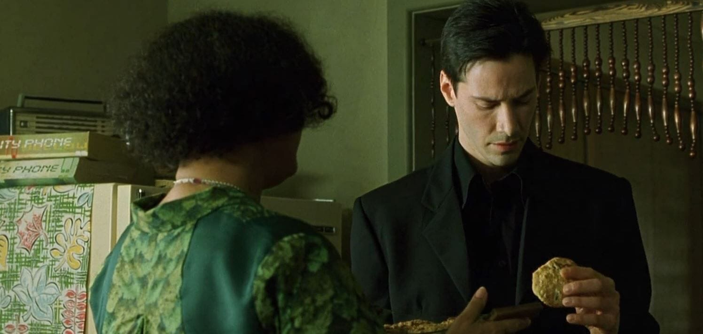

# Лабораторна робота №7. Робота з Cookies та механізмом сесій

[Перелік усіх робіт](../README.md)

## Мета роботи

Навчитися створювати, читати, змінювати й видаляти cookies у PHP, зберігати стан між запитами за допомогою сесії та перевіряти дані клієнта. Створити «Панель студентського клубу»: налаштування оформлення, історію відвідувань і список обраних заходів.

## Обладнання та передумови

Основне навчальне середовище — **OSPanel 6+ з PHP 8.1**. Альтернатива — **XAMPP із PHP 8.1**. Налаштування домену, каталогів і консолі наведено в [пам’ятці середовища](../../ENVIRONMENT.md).

Комп’ютер, PHP 8.1 в OSPanel 6+ або альтернативному XAMPP, редактор коду та браузер із засобами розробника. Потрібні знання форм, масивів, функцій і HTML-екранування з [ЛР 5](../lab-05/README.md), а також порядку «обробка — перенаправлення — виведення» з [ЛР 6](../lab-06/README.md).

Робота виконується на чистому PHP. Для наведених прикладів використовуйте PHP 8.1. Запишіть фактичну версію PHP вебсервера; вона може відрізнятися від версії PHP у терміналі.

## Теоретичні відомості

### Як працюють cookies

Cookie — невелике значення, яке браузер зберігає для сайту. Сервер пропонує його через заголовок відповіді `Set-Cookie`, а браузер додає його до заголовка `Cookie` наступних відповідних запитів. Спосіб зберігання залежить від браузера: окремий текстовий файл не є обов’язковим.



Cookies придатні для несекретних налаштувань. Браузер обмежує їхній розмір і кількість, тому великі тексти та файли в них не зберігають. Користувач може змінити чи видалити значення; cookies не є надійним джерелом прав доступу, цін або статистики.

| Атрибут | Значення для цієї роботи |
| --- | --- |
| `expires` | Unix timestamp завершення строку дії; `0` означає сесійну cookie |
| `path` | `/lab-07/`: cookie надсилається для відповідного шляху; це не засіб розмежування доступу |
| `domain` | Не задаємо: cookie прив’язана до поточного хоста |
| `secure` | У середовищі HTTPS — `true`; для локального HTTP у вправі — `false` |
| `httponly` | `true`: JavaScript не читає cookie через `document.cookie` |
| `samesite` | `Lax`: обмежує надсилання в частині міжсайтових запитів |

`HttpOnly` не означає «лише незахищений HTTP», а `Secure` не шифрує саме значення cookie. `SameSite` доповнює захист від CSRF, але не замінює перевірку токена. Сесійні cookies можуть відновлюватися браузером разом із вкладками: закриття вікна не слід вважати гарантованим виходом.

### Cookies у PHP

`setcookie()` викликають до будь-якого виведення, зокрема HTML, пробілів або BOM. Значення запиту читають через `$_COOKIE`; воно не змінюється автоматично після `setcookie()` у поточному виконанні. Повернення `true` означає підготовку заголовка, а прийняття cookie перевіряють у браузері та наступному запиті.

```php
<?php
$options = [
    'expires' => time() + 30 * 24 * 60 * 60,
    'path' => '/lab-07/',
    'secure' => false, // Лише локальний HTTP; для HTTPS — true.
    'httponly' => true,
    'samesite' => 'Lax',
];
setcookie('club_theme', 'dark', $options);
```

Для видалення задайте минулий `expires` та ті самі `path` і `domain`, з якими cookie створено. `unset($_COOKIE['club_theme'])` прибирає лише елемент масиву поточного запиту.

### Сесія та безпечне введення

HTTP сам по собі не зберігає стан застосунку. PHP-сесія пов’язує запити через ідентифікатор, зазвичай у cookie, а дані `$_SESSION` зберігає на сервері. Типовий файловий обробник — лише один зі способів зберігання.

`session_start()` створює або відновлює сесію до виведення. `unset($_SESSION['favorites'])` видаляє один запис. `session_destroy()` видаляє серверні дані поточної сесії, але самостійно не очищує `$_SESSION` та cookie ідентифікатора. Час життя серверних даних залежить від налаштувань; це не обов’язково час життя cookie.

Паролі, їхні хеші та секрети не зберігайте в cookies і не показуйте у формах. Ідентифікатор сесії також є чутливим значенням. У цій роботі немає входу користувача; у справжній системі після успішної автентифікації потрібно змінювати ідентифікатор через `session_regenerate_id(true)`.

Перевіряйте типи й допустимі значення `$_POST` та `$_COOKIE`. Для теми достатньо переліку `light`/`dark`; масив замість рядка має бути відхилений. Перед виведенням тексту в HTML застосовуйте `htmlspecialchars()`. Зміни налаштувань і списку виконуйте через POST із CSRF-токеном. Після успіху повертайте `303` на GET, щоб оновлення сторінки не повторювало дію.

## Хід роботи

### 1. Підготуйте проєкт

1. Запустіть вебсервер проєкту й створіть `C:\xampp\htdocs\lab-07`. Інші проєкти не видаляйте. Запишіть версію PHP вебсервера.
2. Відкривайте `http://web-prog.local/lab-07/`, використовуючи один хост: `localhost` і `127.0.0.1` мають різні cookies.
3. Створіть `bootstrap.php`, `index.php`, `preferences.php`, `visits.php` та `favorites.php`. Збережіть їх у UTF-8 без BOM.
4. У засобах розробника знайдіть Network і сховище Cookies у вкладці Application або Storage.

До `bootstrap.php` внесіть спільну заготовку. На початку кожної сторінки підключайте її через `require __DIR__ . '/bootstrap.php';`. Шлях cookie відповідає адресі проєкту; за іншої адреси змініть його в усіх операціях узгоджено.

```php
<?php
const COOKIE_PATH = '/lab-07/';
const COOKIE_SECURE = false; // Локальний HTTP; для HTTPS — true.

ini_set('session.use_strict_mode', '1');
ini_set('session.use_only_cookies', '1');
session_name('LAB07SESSID');
session_set_cookie_params([
    'lifetime' => 0,
    'path' => COOKIE_PATH,
    'secure' => COOKIE_SECURE,
    'httponly' => true,
    'samesite' => 'Lax',
]);
if (!session_start()) {
    http_response_code(500);
    exit('Не вдалося відкрити сесію.');
}
if (!isset($_SESSION['csrf'])) {
    $_SESSION['csrf'] = bin2hex(random_bytes(32));
}

function e(string $value): string
{
    return htmlspecialchars($value, ENT_QUOTES | ENT_SUBSTITUTE, 'UTF-8');
}

function cookieOptions(int $expires): array
{
    return [
        'expires' => $expires,
        'path' => COOKIE_PATH,
        'secure' => COOKIE_SECURE,
        'httponly' => true,
        'samesite' => 'Lax',
    ];
}

function requireValidPost(): void
{
    if (($_SERVER['REQUEST_METHOD'] ?? '') !== 'POST') {
        header('Allow: POST');
        http_response_code(405);
        exit('Потрібен POST-запит.');
    }
    $token = $_POST['csrf'] ?? null;
    if (!is_string($token) || !hash_equals($_SESSION['csrf'], $token)) {
        http_response_code(403);
        exit('Недійсний токен форми.');
    }
}
```

У кожну POST-форму додайте поле:

```html
<input type="hidden" name="csrf" value="<?= e($_SESSION['csrf']) ?>">
```

Це фрагмент PHP-шаблону, а не окремий статичний HTML-файл. Функцію `requireValidPost()` викликайте лише в гілці обробки POST сторінки з формою або на початку окремого обробника. Самі сторінки мають відкриватися через GET.

### 2. Реалізуйте налаштування оформлення

На `index.php` покажіть назву клубу, меню та поточну тему. На `preferences.php` створіть форму з вибором світлої або темної теми й окрему POST-форму «Скинути налаштування».

1. На GET прочитайте `club_theme`, перевірте тип і перелік значень. Для відсутнього або неправильного значення застосуйте `light`.
2. На POST перевірте CSRF-токен, дію (`save` або `reset`) та тему. Невідому дію чи тему відхиліть із повідомленням без зміни cookies. Для `reset` поле теми не потрібне.
3. Для `save` збережіть тему на 30 днів; для `reset` видаліть cookie із минулим строком дії. Перевірте результат виклику; за невдачі не повідомляйте про успіх.
4. Після успіху виконайте `header('Location: index.php', true, 303); exit;` до розмітки.
5. Застосуйте CSS-клас із перевіреної теми. Не підставляйте довільне значення cookie у CSS або HTML.

Приклад читання:

```php
$rawTheme = $_COOKIE['club_theme'] ?? null;
$theme = is_string($rawTheme) && in_array($rawTheme, ['light', 'dark'], true)
    ? $rawTheme
    : 'light';
```

У Network дослідіть POST-відповідь із `Set-Cookie`, перенаправлення та наступний GET із `Cookie`. Поясніть, чому нова тема читається після нового запиту. Перевірте, що JavaScript не бачить `HttpOnly` cookie, хоча вона присутня в сховищі браузера.

### 3. Створіть лічильник відвідувань

На `visits.php` реалізуйте початкове «Ласкаво просимо!», номер поточного перегляду та час попереднього. Зберігайте `club_visits` і `club_last_visit` на сім днів. Рахуйте лише GET-запити до цієї сторінки; оновлення також є переглядом.

- Приймайте лічильник як рядок десяткових цифр зі значенням 0–999999; масиви, від’ємні, дробові та завеликі значення вважайте некоректними й починайте з нуля. На верхній межі залишайте 999999.
- Час зберігайте як Unix timestamp. Приймайте лише рядок цифр зі значенням від 1 до поточного `time()`; для інших значень показуйте «Попередній час недоступний».
- Спочатку запам’ятайте перевірені старі значення, потім обчисліть новий лічильник і запишіть поточний час. Показуйте новий номер перегляду, але попередній час.
- Задайте `date_default_timezone_set('Europe/Kyiv');` і форматуйте час через `date('d.m.Y H:i:s', $previousTime)`.
- Якщо cookie лічильника відсутня або некоректна, показуйте початкове привітання й номер 1. Несправна cookie часу не повинна скидати коректний лічильник.

Для чисел можна використати `ctype_digit()` та `FILTER_VALIDATE_INT` з `min_range`/`max_range`, попередньо перевіривши рядковий тип. Значення записуйте у звичайному десятковому форматі без початкових нулів. Пам’ятайте, що `0` є допустимим результатом, а `false` означає невдалу перевірку. Перевірте результати обох записів cookie й повідомте про збій підготовки заголовків. Якщо cookies заблоковані, нові запити не матимуть збереженої історії. Цей лічильник демонструє стан браузера, а не кількість людей на сайті.

### 4. Додайте сесійний список обраного

На `favorites.php` задайте фіксований каталог щонайменше трьох заходів із короткими ідентифікаторами, наприклад `cinema`, `quiz`, `eco`. Відображайте каталог і список обраного; назви беріть із серверного масиву та екрануйте.

1. Зберігайте в `$_SESSION['favorites']` масив ідентифікаторів; початкове значення — порожній масив.
2. Через POST із CSRF-токеном реалізуйте дії `add`, `remove`, `clear`. Перевіряйте дію, рядковий тип і наявність ідентифікатора в каталозі. Для `clear` ідентифікатор не потрібен.
3. Повторне додавання не створює дубліката. Видалення відсутнього заходу не спричиняє помилки. Після дії перенаправляйте на GET.
4. Покажіть кількість обраних на `index.php`, щоб продемонструвати спільний стан різних сторінок.
5. Додайте окрему POST-дію «Завершити сеанс». Після перевірки токена очистьте `$_SESSION`, видаліть cookie `session_name()` із відповідними параметрами та викличте `session_destroy()`. Перевірте результати операцій і лише після успіху перенаправте на `index.php`.

Завершення сеансу очищує обране, але зберігає тему й історію відвідувань. Наступний GET створює нову порожню сесію та новий CSRF-токен. «Очистити обране» видаляє лише список і залишає поточну сесію. Не передавайте ідентифікатор сесії в URL.

### 5. Невелике розширення за бажанням

Оберіть одну ідею: POST-кнопка скидання історії відвідувань; друга cookie для компактного вигляду каталогу; одноразове повідомлення про успішну дію в сесії. Основна робота завершена після кроків 1–4 та перевірок нижче.

## Перевірка та очікуваний результат

| Перевірка | Очікуваний результат |
| --- | --- |
| Перший GET без cookies | Світла тема, порожнє обране; на visits.php — привітання й номер 1 |
| Збереження темної теми | POST → 303 → GET; тема застосована на різних сторінках |
| Повторне відкриття браузера з дозволеними постійними cookies | Тема й історія зберігаються до завершення строку дії або видалення |
| Скидання теми | Cookie теми видалено для правильного шляху, використовується light |
| Другий і третій GET visits.php | Номери 2 і 3; час кожного попереднього перегляду |
| Лічильник 0, 999998 і 999999 | Нові значення 1, 999999 і 999999 |
| Лічильник -1, 1.5, 1000000 або масив | Початковий номер 1 без warning чи TypeError |
| Відсутній, майбутній або некоректний попередній час | Повідомлення про недоступний час, коректний лічильник працює |
| Тема unknown, `<b>dark</b>` або масив у cookie | Світла тема без виконання розмітки та помилок PHP |
| Невідома дія або ідентифікатор; масив замість поля POST | Відмова без зміни стану |
| Відсутній, змінений або масивний CSRF-токен | HTTP 403 без зміни стану |
| Двічі доданий той самий захід | Один запис в обраному |
| Оновлення після POST | Дія не повторюється |
| Друга вкладка того самого браузера | Спільний список обраного після оновлення |
| Окремий приватний контекст браузера | Незалежні налаштування, історія й сесія |
| Очищення обраного та завершення сеансу | В обох випадках список порожній; лише завершення створює нову сесію після переходу |
| Cookies заблоковані для сайту | Тема й історія не зберігаються; сесійна POST-форма може отримати 403 через втрату сесії |

Некоректні cookies перевіряйте редагуванням їхніх значень у сховищі. Для масивної cookie використайте ім’я `club_theme[test]`, попередньо видаливши звичайну `club_theme`. Масивні поля POST відтворюйте зміною `name="theme"` на `name="theme[]"` у формі. Перед наступним сценарієм відновіть початкові дані. Перевіряйте строки дії також із тимчасово коротким інтервалом, потім поверніть умови завдання.

Для кожного сценарію запишіть фактичний результат. Порівнюючи сесії, не додавайте повні ідентифікатори чи CSRF-токени у звіт: достатньо висновку «змінився/не змінився». Невиконані перевірки позначте із причиною. Перевірте сформований HTML через [W3C Markup Validation Service](https://validator.w3.org/), вставивши код відповіді, а не PHP-шаблон. Поля мають мати підписи, кнопки — зрозумілі назви.

Результат — застосунок із постійними несекретними налаштуваннями та серверним списком обраного. Код не видає попереджень для відсутніх або неправильних даних; зміну стану відокремлено від виведення. Оцінювання здійснюється за критеріями [робочої програми](../../+РПНД%20WП%202023+.docx); окремої бальної шкали тут не запроваджено.

## Вимоги до подання

Подайте вихідні PHP-файли та PDF-звіт. Звіт має містити:

1. Тему, мету, фактичну версію PHP, адресу запуску та перелік файлів із призначенням.
2. Пояснення руху даних `Set-Cookie` → браузер → `Cookie` → `$_COOKIE`, а також відмінності від `$_SESSION` на прикладі власного коду.
3. Таблицю «сценарій — вхідні дані — очікуваний результат — фактичний результат — висновок» за перевірками вище.
4. Підписані знімки налаштувань, історії, обраного та заголовків із прихованими чутливими значеннями.
5. Власний код ключових обробників, відповіді на контрольні питання й висновок про виправлені помилки та обмеження cookies. Відокремте готову заготовку від власних доповнень.

## Контрольні питання

1. Чим відрізняються заголовки Set-Cookie й Cookie?
2. Чому setcookie(), session_start() і header() викликають до виведення?
3. Чому $_COOKIE не містить щойно встановленого значення в поточному запиті?
4. Як впливають expires, path і domain на надсилання й видалення cookie?
5. Чим відрізняються Secure, HttpOnly та SameSite?
6. Чому значення cookies потрібно перевіряти, а паролі не можна зберігати в них?
7. Де зберігаються дані PHP-сесії та як браузер пов’язує запити із сесією?
8. Чим відрізняються unset(), очищення $_SESSION і session_destroy()?
9. Чому закриття браузера не гарантує завершення серверної сесії?
10. Для чого потрібні CSRF-токен, екранування й перенаправлення після POST?
11. Чому дві вкладки ділять стан, а приватний контекст може мати інший?
12. Чому лічильник у cookie не є достовірною статистикою користувачів?

## Джерела

1. PHP Documentation Group. [setcookie](https://www.php.net/manual/en/function.setcookie.php).
2. PHP Documentation Group. [$_COOKIE](https://www.php.net/manual/en/reserved.variables.cookies.php).
3. PHP Documentation Group. [session_start](https://www.php.net/manual/en/function.session-start.php).
4. PHP Documentation Group. [session_set_cookie_params](https://www.php.net/manual/en/function.session-set-cookie-params.php).
5. PHP Documentation Group. [session_destroy](https://www.php.net/manual/en/function.session-destroy.php).
6. MDN contributors. [Using HTTP cookies](https://developer.mozilla.org/en-US/docs/Web/HTTP/Guides/Cookies).
7. OWASP. [Cross-Site Request Forgery Prevention Cheat Sheet](https://cheatsheetseries.owasp.org/cheatsheets/Cross-Site_Request_Forgery_Prevention_Cheat_Sheet.html).

## Додаткові матеріали

Початкові демонстрації збережено для порівняння: [створення cookie](src/cookie_set.php), [читання](src/cookie_get.php), [видалення](src/cookie_delete.php), [сесія](src/session_simple.php), [сесійний лічильник](src/session_counter.php). Вони не є готовим розв’язком оновленої роботи: використовують інші імена й параметри cookies, а також потребують узгодження з наведеними перевірками та захистом форм. Для виконання використовуйте заготовку й вимоги цієї редакції.
