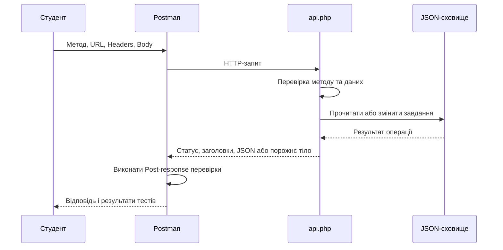
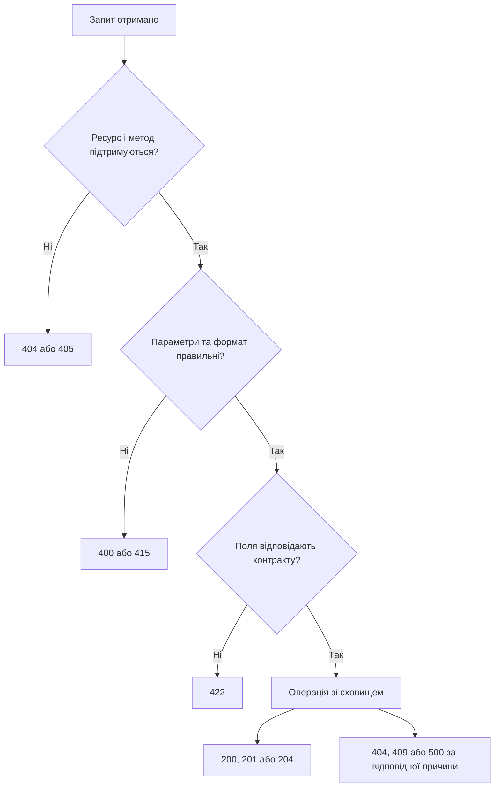
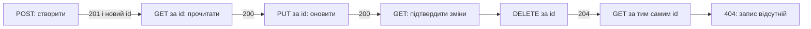

# Лабораторна робота №10. Використання програми Postman для емуляції дій користувача сайту

[Перелік усіх робіт](../README.md)

## Мета роботи

Навчитися складати HTTP-запити в Postman, розрізняти параметри URL, заголовки й тіло, перевіряти відповіді та пояснювати причини помилок. Дослідити локальний PHP API «Список завдань», виконати цикл створення, читання, оновлення й видалення запису та зібрати відтворювану колекцію перевірок.

## Обладнання та передумови

Основне навчальне середовище — **OSPanel 6+ з PHP 8.1**. Альтернатива — **XAMPP із PHP 8.1**. Налаштування домену, каталогів і консолі наведено в [пам’ятці середовища](../../ENVIRONMENT.md).

Комп’ютер, локальний PHP 8.1, OSPanel 6+ (альтернатива — XAMPP); за потреби вбудований сервер цього ж PHP, редактор коду та Postman. Потрібні розширення `mbstring`, `ctype`, `fileinfo`. Працюємо на чистому PHP з JSON-файлом, без бази даних. Повторіть [форми й валідацію](../lab-05/README.md), [файли](../lab-06/README.md) та [XML/JSON](../lab-08/README.md).

Для звернення до локального сервера використовуйте настільний Postman. Якщо обрали вебзастосунок Postman, установіть і запустіть **Desktop Agent** та виберіть його для надсилання запитів: Cloud Agent не має доступу до вашого `localhost`. Обліковий запис Postman потрібен для функцій робочого простору й синхронізації; це не обліковий запис локального PHP API. За потреби входу використайте доступний вам навчальний обліковий запис.

Локальний сервіс призначено для вправ із вигаданими даними. Каталог завдань відкритий, а Basic Auth демонструється окремим ресурсом; це не готова система керування доступом. Не використовуйте справжні паролі, персональні дані чи виробничі API.

## Теоретичні відомості

### Що саме робить Postman

Postman — клієнт, який надсилає HTTP-запити та показує відповіді. Він не запускає PHP замість вебсервера й не перевіряє правильність бізнес-логіки автоматично. Щоб перевірка була змістовною, потрібно заздалегідь визначити очікувані статус, структуру відповіді та зміну даних.



Postman може надіслати запит, який браузерна форма не сформує, наприклад неправильний тип поля або PUT із JSON. Це допомагає перевіряти серверну валідацію. POST сам по собі не означає безпечність, а успішне отримання відповіді ще не означає успішне виконання операції.

### Будова запиту й відповіді

| Частина | Приклад у роботі | Де налаштувати або знайти |
| --- | --- | --- |
| Метод | GET, POST, PUT, DELETE | Список ліворуч від URL |
| Адреса | `{{base_url}}` | Поле URL |
| Query-параметри | `resource=tasks`, `id=3` | Вкладка Params; потрапляють у URL |
| Заголовок запиту | `Content-Type: application/json` | Headers або автоматично через тип Body |
| Тіло | `{"title":"Перевірити POST","done":false}` | Body → raw → JSON |
| Статус відповіді | `201 Created` | Панель відповіді |
| Заголовок відповіді | `Location: api.php?resource=tasks&id=3` | Headers у панелі відповіді |
| Тіло відповіді | `data` або `error` | Body у панелі відповіді |

`Content-Type` описує формат **тіла запиту**, `Accept` — бажаний формат відповіді. Сервер цього прикладу повертає JSON незалежно від Accept; клієнт не може довільним заголовком змінити його реалізацію. Query-параметри є рядками: `done=1` у URL відрізняється від логічного `"done": true` у JSON. JSON-тіло PHP читає через `php://input`, а не через `$_POST`.

Методи мають різне призначення: GET читає, POST створює, PUT замінює змінювані поля конкретного запису, DELETE видаляє. Повторний POST може створити ще один запис. Повторний DELETE у цій реалізації після першого успіху повертає 404, але запис залишається видаленим.

### Контракт навчального API

Точка входу — `api.php`, ресурс обирається параметром `resource`. Така адреса працює без налаштування маршрутизації чи переписування URL. Ідентифікатор запису також передаємо через query.

| Метод і параметри | Призначення | Успішна відповідь |
| --- | --- | --- |
| GET `resource=tasks` | Список завдань | 200, `data` — масив, `meta.count` — кількість |
| GET `resource=tasks&done=1` | Лише виконані; `done=0` — невиконані | 200, відфільтрований список |
| GET `resource=tasks&id=...` | Один запис | 200, `data` — об’єкт |
| POST `resource=tasks` | Створення із JSON | 201, новий запис і Location |
| PUT `resource=tasks&id=...` | Заміна title та done із JSON | 200, оновлений запис |
| DELETE `resource=tasks&id=...` | Видалення | 204, порожнє тіло |
| POST `resource=echo` | Дослідження форми або вкладення | 200, отримані поля й метадані файла |
| GET `resource=auth` | Демонстрація Basic Auth | 200 за правильних демонстраційних даних |

Поля завдання: `id` — додатне ціле число, яке створює сервер; `title` — рядок від 1 до 80 символів після `trim()`; `done` — JSON-значення `true` або `false`. Для POST поле done необов’язкове й типово false; для PUT обидва поля обов’язкові. Невідомі поля відхиляються. JSON-тіло обмежено 16 KiB, каталог — 100 записами. Ці межі є умовами навчальної вправи.

| Статус | Як отримати у цій роботі |
| --- | --- |
| 200 | Успішне читання, оновлення, echo або Basic Auth |
| 201 | Запис створено |
| 204 | Запис видалено; JSON-тіла немає |
| 400 | Зіпсований JSON, неправильний query-параметр або відсутній id |
| 401 | Немає правильних даних для ресурсу auth |
| 404 | Невідомий ресурс або запис |
| 405 | Метод не підтримується; дивіться Allow |
| 409 | Досягнуто межу каталогу |
| 413 | Перевищено ліміт тіла запиту |
| 415 | Невідповідний Content-Type |
| 422 | Синтаксис розібрано, але поля порушують контракт |
| 500 | Помилка середовища, читання чи запису сховища |



## Хід роботи

### 1. Запустіть локальний сервіс

1. Створіть окремий каталог `lab-10` у публічному каталозі OSPanel; для альтернативного XAMPP — `C:\xampp\htdocs\lab-10` та скопіюйте до нього [src](src). Інші проєкти не видаляйте.
2. У терміналі перейдіть до `lab-10/src`. Виконайте `php reset.php`; якщо PHP немає у PATH, використайте `C:\xampp\php\php.exe reset.php`.
3. Скрипт відновить **два** початкові записи й покаже шлях до сховища. Повторний запуск замінює лише дані цієї навчальної копії API; використовуйте його перед новим повним прогоном. Каталог сховища розміщено у тимчасовому каталозі ОС, поза вебкаталогом, а його назва залежить від шляху копії проєкту.
4. Запустіть вебсервер проєкту OSPanel із PHP 8.1. Адреса API для прикладу домену: `http://web-prog.local/lab-10/src/api.php`. Для альтернативного XAMPP запустіть Apache й використайте `http://localhost/lab-10/src/api.php`.
5. Альтернатива без Apache: з каталогу `src` виконайте `php -d display_errors=0 -d log_errors=1 -S 127.0.0.1:8080`; адреса — `http://127.0.0.1:8080/api.php`. Залиште термінал відкритим, після роботи зупиніть сервер Ctrl+C. Для Apache також налаштуйте журналювання помилок без виведення діагностики в HTTP-тіло: повідомлення PHP, зокрема під час запуску обробки запиту, не повинні пошкоджувати JSON. Причини помилок перевіряйте в журналі, а не приховуйте оператором `@`.
6. Відкрийте адресу API у браузері: очікується JSON із двома записами. Якщо отримано 500, перевірте журнал PHP, mbstring і доступ до сховища. CLI та вебсервер повинні використовувати однаковий шлях сховища; за різних тимчасових каталогів задайте спільний абсолютний каталог у функції `dataPath()` в common.php.

Початкові записи мають id 1 і 2; перший невиконаний, другий виконаний. Зміни зберігаються у JSON між запитами й перезапусками сервера, доки тимчасовий каталог не очищено. API не використовує сесію браузера. Функція `withStore()` блокує повний цикл читання/зміни/запису; це локальний навчальний приклад, а не заміна бази даних чи резервного копіювання.

### 2. Створіть колекцію та середовище Postman

1. Відкрийте Postman і робочий простір. У розділі **Collections** створіть колекцію `ЛР 10 — HTTP і Postman`. Колекція — набір збережених запитів, а не сервер.
2. У розділі **Environments** створіть середовище `Lab10 Local`.
3. Додайте змінну `base_url` зі значенням адреси API з кроку 1, **без query-параметрів**. Додайте `task_id` із порожнім значенням. Заповнюйте значення, яке використовується локально; у різних редакціях інтерфейсу назви колонок можуть відрізнятися.
4. Збережіть середовище й виберіть `Lab10 Local` у селекторі активного середовища. Не створюйте однойменну глобальну змінну: інша область видимості може підставити несподіване значення.
5. У колекції встановіть Authorization → **No Auth**. Створюйте запити через Add request або New → HTTP Request, надавайте змістовні назви та натискайте Save після налаштування.

У URL `{{base_url}}` Postman підставляє значення змінної перед надсиланням. Якщо змінна не визначена, адреса не перетвориться на правильний URL. Перевірте активне середовище, назву й значення.

Для порівняння або відновлення налаштувань можна через **Import** завантажити [готову колекцію](postman/lab10.postman_collection.json) і [середовище](postman/lab10.postman_environment.json). У середовищі замініть base_url відповідно до власного запуску. Спочатку виконайте кроки вручну; готова колекція допомагає звірити результати.

### 3. GET: список, параметри та відповідь

1. Створіть запит `01 — Список завдань`, оберіть GET, у URL введіть `{{base_url}}`.
2. У **Params** додайте рядок `resource` → `tasks`, переконайтеся, що його прапорець увімкнено. Postman додасть `?resource=tasks` до адреси. Не додавайте той самий параметр вдруге вручну в URL.
3. У **Headers** додайте `Accept` → `application/json`. Body залиште без тіла. Натисніть **Send**.
4. У відповіді перевірте статус 200, Body з масивом data та meta.count = 2. У Headers знайдіть `Content-Type: application/json; charset=UTF-8`.
5. Збережіть запит. Створіть його копію `02 — Фільтр виконаних`, у Params додайте `done` → `1`. Очікується один запис із done = true. Змініть done на 0 та порівняйте результат; потім поверніть 1.
6. Тимчасово додайте `id` → `1` і вимкніть рядок done: отримайте об’єкт одного завдання. Увімкнені одночасно id та done у цьому API дають 400. Після дослідження відновіть запити списку й фільтра.

Так виглядає запит на рівні HTTP; фактичні службові заголовки клієнта можуть відрізнятися:

```http
GET /lab-10/src/api.php?resource=tasks&done=1 HTTP/1.1
Host: web-prog.local
Accept: application/json
```

```json
{
  "data": [{"id": 2, "title": "Підготувати тестові дані", "done": true}],
  "meta": {"count": 1}
}
```

Відповідь JSON не є HTML-сторінкою. Не оцінюйте успіх лише за кольором статусу: зіставляйте тіло з контрактом.

### 4. POST: дослідіть дані HTML-форми

1. Створіть запит `03 — URL-encoded форма`: POST, `{{base_url}}`, Params: resource → echo.
2. Перейдіть у **Body → x-www-form-urlencoded**. Додайте `name` → `Студент DEMO`, `group` → `DEMO`.
3. Postman сформує відповідний Content-Type. Не залишайте вручну доданий `application/json` від іншого запиту.
4. Надішліть запит. Очікується 200; у `data.fields` перевірте name і group, у `data.content_type` — `application/x-www-form-urlencoded`.
5. Поясніть відмінність: поля Body передаються в тілі, а resource з Params — в URL. На сервері поля форми потрапляють у `$_POST`.

```http
POST /lab-10/src/api.php?resource=echo HTTP/1.1
Host: web-prog.local
Content-Type: application/x-www-form-urlencoded

name=Student%20DEMO&group=DEMO
```

Тут HTTP-приклад використовує латинський текст для читабельності URL-кодування. У Postman вводьте звичайний український текст: кодування виконає клієнт.

### 5. Multipart: надішліть файл

1. Створіть окремий POST-запит до resource=echo. Оберіть **Body → form-data**.
2. Додайте поле name типу **Text** зі значенням `Студент DEMO`.
3. Додайте поле `attachment`; у списку типу біля поля змініть Text на **File** й оберіть [sample.txt](src/sample.txt) зі своєї локальної копії.
4. Видаліть вручну встановлений Content-Type, якщо він є. Postman сам додасть `multipart/form-data` з параметром **boundary**, що відокремлює частини форми. Без відповідного boundary сервер не розбере запит правильно.
5. Натисніть Send. Очікується 200: `data.file.name`, `size` і `detected_mime`. Порівняйте size з фактичним розміром файла. Сервер повертає метадані й не зберігає вкладення як постійний файл.
6. Для вправи допустиме одне вкладення розміром 1–65536 байтів, уся форма — до 100 KiB. Не надсилайте справжні документи. Ліміти PHP `upload_max_filesize` та `post_max_size` також мають дозволяти запит.

Вміст файла не вставляється вручну в raw JSON. У готовій колекції цей запит винесено в папку **02 — Ручне завантаження файла**: після імпорту шлях до файла потрібно вибрати на власному комп’ютері.

### 6. POST із JSON: створіть завдання

1. Створіть запит `04 — Створити завдання`: POST, Params: resource → tasks; параметр id не додавайте.
2. Оберіть **Body → raw → JSON**. Уведіть:

```json
{"title": "Перевірити POST", "done": false}
```

3. У Headers перевірте Content-Type: application/json; за потреби увімкніть показ автоматично доданих заголовків. Для одного заголовка не створюйте суперечливих дублікатів.
4. Натисніть Send. Очікується **201**, об’єкт data та заголовок Location. Після reset.php новий id буде 3; після інших створень він може бути іншим.
5. У відповіді знайдіть id і внесіть його в локальне значення змінної task_id. Далі використовуватимемо `{{task_id}}`, а не припускатимемо постійно id=3.
6. Повторіть GET списку: запис має з’явитися. Повторний Send для POST створює ще один запис, тому не натискайте його багато разів для «оновлення».

```http
POST /lab-10/src/api.php?resource=tasks HTTP/1.1
Host: web-prog.local
Content-Type: application/json
Accept: application/json

{"title":"Перевірити POST","done":false}
```

Фрагмент обробки JSON у PHP:

```php
$raw = file_get_contents('php://input');
$body = json_decode($raw, true, 32, JSON_THROW_ON_ERROR);
```

Це лише читання й розбір. У [taskBody()](src/common.php) додатково перевірено Content-Type, розмір, кореневий об’єкт, назви полів, типи та межі. Правильний JSON `{"title": [], "done": "false"}` не є правильним завданням.

### 7. GET одного запису й PUT: прочитайте та оновіть

1. Створіть GET `05 — Прочитати створене`: Params: resource → tasks, id → `{{task_id}}`. Надішліть і зіставте title та id з POST-відповіддю.
2. Створіть PUT `06 — Оновити завдання` з тими самими Params. Body → raw → JSON:

```json
{"title": "Перевірити PUT", "done": true}
```

3. Надішліть: очікується 200, незмінний id, новий title та done = true.
4. Повторіть GET одного запису й підтвердьте, що зміни збережено. Самої PUT-відповіді недостатньо для перевірки збереження.
5. Видаліть done із PUT-тіла та перевірте 422; поверніть правильне тіло й збережіть запит. У цій реалізації PUT вимагає повного набору змінюваних полів; частковий PATCH не реалізовано.

### 8. DELETE: видаліть і перевірте результат

1. Створіть DELETE `08 — Видалити завдання`: Params: resource → tasks, id → `{{task_id}}`. У Body оберіть **none**.
2. Надішліть: очікується **204 No Content**. Порожня панель Body тут правильна; не намагайтеся викликати JSON-парсер для цієї відповіді.
3. Створіть GET `09 — Перевірити відсутність` із тим самим id: очікується 404 з error.message.
4. Повторіть GET списку: запис відсутній. Інші записи залишилися. Для повторення всього циклу почніть із створення нового запису або відновіть навчальні дані через reset.php.



### 9. Перевірте помилкові запити

Створіть окремі запити, не змінюючи вже збережений правильний сценарій. Для кожного перед Send запишіть прогноз, потім фактичний статус і причину.

| Назва / запит | Як налаштувати | Очікування |
| --- | --- | --- |
| Порожній title | POST tasks, JSON `{"title":"   ","done":false}` | 422 |
| Неправильний тип | POST tasks, JSON `{"title":[],"done":"false"}` | 422 |
| Пошкоджений JSON | POST tasks, raw JSON `{"title":"Тест",}` | 400 |
| Неправильний формат | POST tasks, raw Text, Content-Type: text/plain | 415 |
| Масив query | GET tasks, Params: `id[]` → `1` | 400 |
| Невідомий запис | GET tasks, id → 999999999 після початкового reset | 404 |
| Невідомий ресурс | GET, resource → unknown | 404 |
| Непідтримуваний метод | PATCH, resource → tasks | 405 і Allow із підтримуваними методами |
| Відсутній id | DELETE tasks без id | 400 |

Після невдалого POST перевірте GET списку: неправильний запис не повинен з’явитися. Статуси 400, 415 та 422 відображають різні причини; не замінюйте їх усі повідомленням «сервер не працює».

### 10. Basic Auth: дослідіть заголовок автентифікації

1. Створіть GET до resource=auth. У **Authorization** виберіть **No Auth** й натисніть Send: очікується 401 та `WWW-Authenticate` із Basic.
2. Змініть тип на **Basic Auth**. Username: `student`, Password: `demo-pass`. Це відкриті демонстраційні значення, закладені в коді вправи.
3. Надішліть запит: очікується 200 та `data.authenticated = true`.
4. Змініть пароль на неправильний: очікується 401. Поверніть демонстраційний пароль і збережіть правильний запит окремо від No Auth.
5. Через Postman Console або перегляд заголовків дослідіть Authorization. Не додавайте цей заголовок вдруге вручну. На знімках закрийте його значення: навіть навчальна звичка приховувати облікові дані корисна.

Basic Auth передає пару «користувач:пароль» у Base64; **Base64 не є шифруванням**. HTTP допускається тут лише для локальної демонстрації, справжні облікові дані передають через HTTPS. Успішний Basic Auth до resource=auth не створює cookie входу та не захищає resource=tasks: це різні ресурси цього навчального API.

### 11. Додайте автоматичні перевірки

У запиті відкрийте **Scripts → Post-response**; у старіших редакціях це вкладка Tests. Скрипт виконується після отримання відповіді, а не на PHP-сервері. Результати дивіться в панелі **Test Results** відповіді.

Для GET списку:

```javascript
pm.test("Статус 200", () => pm.response.to.have.status(200));
pm.test("Відповідь JSON", () => {
    pm.expect(pm.response.headers.get("Content-Type")).to.include("application/json");
});
pm.test("Масив і правильний підсумок", () => {
    const body = pm.response.json();
    pm.expect(body.data).to.be.an("array");
    pm.expect(body.meta.count).to.equal(body.data.length);
});
```

Для POST створення додайте перевірку й автоматичне збереження id:

```javascript
pm.test("Статус 201", () => pm.response.to.have.status(201));
if (pm.response.code === 201) {
    const task = pm.response.json().data;
    pm.test("Правильний запис", () => {
        pm.expect(task.id).to.be.a("number").above(0);
        pm.expect(task.title).to.equal("Перевірити POST");
        pm.expect(task.done).to.equal(false);
    });
    if (Number.isInteger(task.id)) {
        pm.environment.set("task_id", task.id);
    }
}
```

У **Scripts → Pre-request** цього POST-запиту додайте `pm.environment.unset("task_id");`, щоб за невдалого створення не використовувати застарілий id. Переконайтеся, що активне середовище вибрано. У DELETE перевіряйте порожній текст:

```javascript
pm.test("Статус 204", () => pm.response.to.have.status(204));
pm.test("Тіло порожнє", () => pm.expect(pm.response.text()).to.equal(""));
```

Додайте власні перевірки PUT, 404, 422, Allow та Basic Auth. Щоб перевірити сам тест, тимчасово замініть очікуваний статус на неправильний: перевірка має стати невдалою. Після цього поверніть правильний код. Не фіксуйте довільний поріг часу як критерій оцінювання: швидкість залежить від середовища.

### 12. Запустіть послідовний сценарій і збережіть матеріали

1. Згрупуйте основні запити в папку й розташуйте за порядком: список → фільтр → форма → створення → читання → оновлення → видалення → підтвердження 404 → негативні запити → Basic Auth.
2. Зупиніть ручні зміни, виконайте reset.php. У готовій колекції відкрийте папку **01 — Основний сценарій** й оберіть **Run** / запуск у Collection Runner.
3. Перевірте вибране середовище, порядок запитів і **одну ітерацію**. Не включайте папку ручного файла, доки не налаштовано локальне вкладення.
4. Запустіть і перегляньте результати кожного запиту. Помилка створення робить подальші залежні запити недостовірними: спочатку виправте її, потім відновіть дані й повторіть сценарій.
5. Експортуйте колекцію у JSON (формат Collection v2.1, якщо доступний у діалозі), середовище та результати перевірок доступним у вашій редакції способом. Якщо експорт результатів недоступний, додайте таблицю й знімок Runner.
6. У середовищі й колекції залишайте лише навчальні значення. Результат task_id можна очистити перед поданням; власні шляхи вкладень інший користувач має налаштувати повторно.

## Завдання для самостійного виконання

Основний результат — власноруч налаштована колекція й пояснення її результатів. Для закріплення PHP доповніть готовий API фільтром `q` у GET списку: пошук підрядка title без урахування регістру, рядковий тип, після trim() до 40 символів; порожній q означає відсутність пошуку. Поєднання q з done має застосовувати обидва фільтри, q з id відхиляйте так само, як done з id.

Додайте щонайменше чотири запити й тести: український текст в іншому регістрі, відсутній збіг, поєднання q та done, масив `q[]` замість рядка. Зміна лише Postman-параметра не реалізує пошук: потрібно змінити серверний код і підтвердити поведінку. Ця доробка виконується студентом; початковий API реалізує лише фільтр done.

## Очікуваний результат і вимоги до подання

Подайте PHP-файли з власним доповненням, колекцію Postman, середовище та PDF-звіт. Звіт має містити:

1. Тему, мету, фактичні версії PHP і Postman, адресу запуску та коротку інструкцію підготовки даних.
2. Таблицю «назва запиту — метод — URL/query — заголовки — тіло — очікуваний статус і зміна — фактичний результат — висновок». Для GET/DELETE без тіла явно зазначте його відсутність.
3. Пояснення відмінностей query, urlencoded, multipart і raw JSON на власних запитах.
4. Підписані знімки ключових етапів: GET, 201 із id, PUT і наступний GET, 204 і 404, вкладення, 401/200, Test Results і Runner. Знімки не замінюють таблицю.
5. Код власного фільтра q, його перевірки, відповіді на контрольні питання й висновок про виявлені та виправлені помилки. Готовий код відокремте від власного.

Якісне виконання відтворюється після reset.php, правильні запити змінюють дані очікуваним чином, неправильні не створюють записів, тести перевіряють і статус, і зміст. Невиконані сценарії позначайте із причиною. Якщо надалі додати браузерний вхід із cookies, потрібні окремі перевірки прав доступу й CSRF; поточний API не використовує cookie-автентифікацію. JSON не вставляють у HTML без екранування.

Оцінювання здійснюється за критеріями [робочої програми](../../+РПНД%20WП%202023+.docx); окремої бальної шкали тут не запроваджено.

## Типові проблеми

| Симптом | Що перевірити |
| --- | --- |
| Could not send request / ECONNREFUSED | Сервер запущено, правильні хост і порт; помилка транспорту не є HTTP 500 |
| Вебверсія не бачить localhost | Desktop Agent запущено й вибрано; Cloud Agent не підходить |
| Замість JSON отримано HTML | URL веде до api.php, а не до сторінки XAMPP або повідомлення Apache |
| Змінна не підставляється | Активне середовище, точна назва base_url/task_id і локальне значення |
| 415 для JSON | Body raw → JSON; немає дубля Content-Type: text/plain |
| 422 для done | У JSON потрібно false, а не рядок "false" чи число 0 |
| 500 після копіювання API | reset.php виконано для цієї копії; CLI й сервер бачать спільне сховище |
| Runner очікує два записи, а отримує більше | Перед запуском відновлено початкові дані; POST не повторювався вручну |
| Вкладення не передається | Поле attachment має тип File; файл вибрано; Content-Type із boundary створює Postman |
| 204 сприймається як помилка JSON | Ця відповідь без тіла: перевіряйте pm.response.text(), не json() |

## Контрольні питання

1. Які частини HTTP-запиту налаштовують у Postman?
2. Чим query-параметри відрізняються від тіла запиту?
3. Як відрізняються x-www-form-urlencoded, multipart/form-data та application/json?
4. Для чого потрібні Content-Type, Accept, Location та Allow?
5. Чому JSON-тіло не читають через $_POST?
6. Чим відрізняються 201, 204, 400, 415 та 422?
7. Чому після POST потрібно зберігати отриманий id, а не припускати конкретне число?
8. Як довести, що PUT зберіг зміни, а DELETE видалив запис?
9. Яка різниця між середовищем, колекцією та змінною Postman?
10. Коли виконуються Pre-request і Post-response скрипти?
11. Чому Basic Auth потребує HTTPS для справжніх даних і не створює сесію автоматично?
12. Чому перед повторним сценарієм потрібно визначити початковий стан API?
13. Як відрізнити збій підключення від HTTP-помилки сервера?
14. Чому перевірки одного статусу недостатньо для тестування API?

## Приклади та файли

- [api.php](src/api.php) — обробники завдань, echo та демонстрації Basic Auth.
- [common.php](src/common.php) — валідація, JSON-відповіді й файлове сховище.
- [reset.php](src/reset.php) — явна підготовка/відновлення даних через CLI.
- [sample.txt](src/sample.txt) — вкладення для multipart-вправи.
- [Колекція Postman](postman/lab10.postman_collection.json) — 15 послідовних запитів і окремий ручний запит із файлом.
- [Середовище Postman](postman/lab10.postman_environment.json) — base_url і task_id.

## Джерела

1. Postman. [Postman quick start](https://learning.postman.com/docs/getting-started/quick-start/).
2. Postman. [Send parameters and body data with API requests](https://learning.postman.com/docs/use/send-requests/create-requests/parameters/).
3. Postman. [Configure request headers](https://learning.postman.com/docs/use/send-requests/create-requests/headers/).
4. Postman. [Store and reuse values using variables](https://learning.postman.com/docs/use/send-requests/variables/variables/).
5. Postman. [API response structure](https://learning.postman.com/docs/use/send-requests/response-data/responses/).
6. Postman. [Write scripts to test API response data](https://learning.postman.com/docs/tests-and-scripts/write-scripts/test-scripts/).
7. Postman. [Test your API using the Collection Runner](https://learning.postman.com/docs/tests-and-scripts/running-collections/intro-to-collection-runs/).
8. Postman. [Authorization types](https://learning.postman.com/docs/use/send-requests/authorization/authorization-types/).
9. Postman. [About the Postman Agent](https://learning.postman.com/docs/getting-started/basics/about-postman-agent/).
10. PHP Documentation Group. [$_SERVER](https://www.php.net/manual/en/reserved.variables.server.php).
11. PHP Documentation Group. [php:// input/output streams](https://www.php.net/manual/en/wrappers.php.php).
12. PHP Documentation Group. [json_decode](https://www.php.net/manual/en/function.json-decode.php).
13. PHP Documentation Group. [flock](https://www.php.net/manual/en/function.flock.php).

## Додаткові матеріали попередньої редакції

Архівні анімації збережено: [GET](img/10-010.gif), [параметри запиту](img/10-020.gif), [автентифікація](img/10-030.gif). Вони показують попередній інтерфейс і не є покроковою інструкцією до цієї редакції.

Для додаткових вправ залишено [Postman Echo](https://postman-echo.com/get), [JSONPlaceholder](https://jsonplaceholder.typicode.com/) та [його посібник](https://jsonplaceholder.typicode.com/guide/). Зовнішні сервіси можуть бути недоступними або змінювати поведінку; основну роботу виконуємо локально. Створення запису в демонстраційному JSONPlaceholder не слід трактувати як доказ постійного збереження на віддаленому сервері — це потрібно окремо підтверджувати повторним читанням і документацією сервісу.

Посилання [QAGroup](https://qagroup.com.ua/publications/znajomtes-postman-must-have-dlia-qa/) та [Highload.today](https://highload.today/blogs/fichi-postman-kotorye-oblegchat-zhizn-testirovshhika-poshagovaya-instruktsiya-s-video/) збережено для відстежуваності. Їхній поточний зміст і відповідність актуальному інтерфейсу не перевірено; до обов’язкового мінімуму джерел їх не зараховано. Дублікати посилань попередньої редакції об’єднано.
