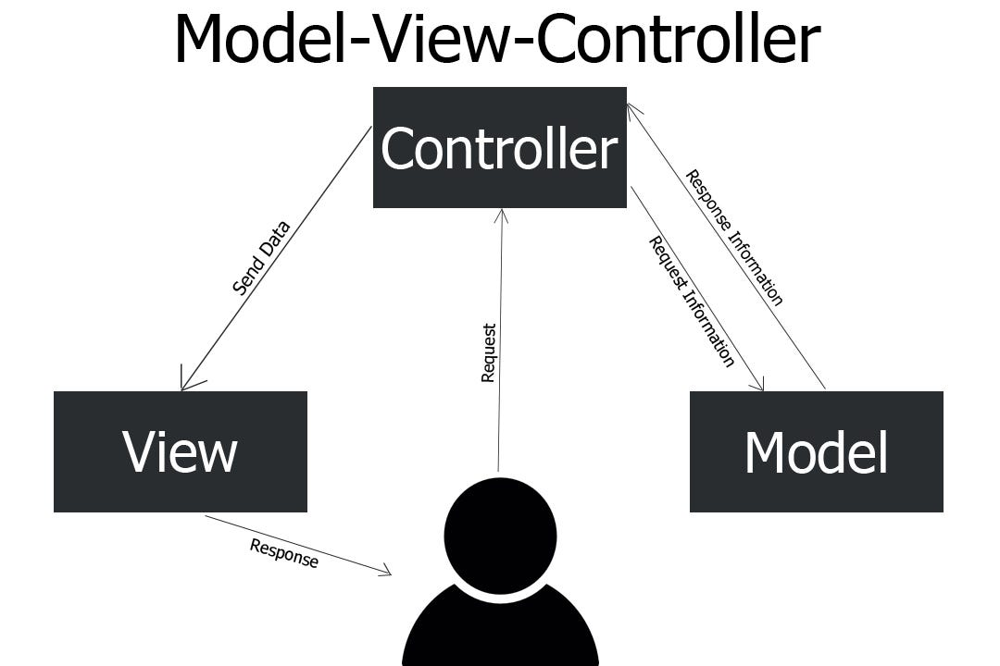

[Перелік усіх робіт](README.md)

# Лабораторна робота №14. Використання класів для створення моделей для архітектури MVC 

## Мета роботи

опанувати основні принципи роботи з моделями, навчитися створювати основу для моделі.

## Обладнання

Персональний комп'ютер. Пакет програм XAMPP. Текстовий редактор Sublime Text 3 або IDE NetBeans. Web-браузер Chrome, Firefox, Opera

## Теоретичні відомості

### MVC

MVC (Model-View-Controller) - це архітектурний шаблон проектування, який використовується в розробці програмного забезпечення для розділення компонентів програми на три основні логічні частини: Model, View і Controller. Кожна з цих частин виконує своє призначення та має взаємодіяти з іншими частинами системи на підставі певних правил. Основні принципи цього шаблону такі:

1. Model (Модель):
    - Модель представляє даний та бізнес-логіку програми.
    - Вона відповідає за доступ до даних, їх зберігання та обробку.
    - Модель не залежить від вигляду або інтерфейсу користувача.
    - Зміни в моделі активують сповіщення (нотифікації) для оновлення інших частин системи, які це вимагають.
2. View (Вид):
    - Вид представляє інтерфейс користувача та відображення даних.
    - Він отримує інформацію від моделі і відображає її користувачу в зручному для сприйняття вигляді.
    - Вид не має виконувати обробку даних, а лише відображати їх.
3. Controller (Контролер):
    - Контролер відповідає за обробку введення користувача, взаємодію з моделлю та вибір відповідного вигляду.
    - Він приймає команди від користувача, визначає, яка модель та вид потрібні, та встановлює взаємозв'язок між ними.
    - Контролер реагує на події та взаємодіє з іншими компонентами.

MVC допомагає розділити логіку програми на логічно ізольовані частини, що спрощує розробку та підтримку програмного забезпечення. Цей шаблон також забезпечує більшу масштабованість і можливість впровадження змін в окремих компонентах без впливу на інші. MVC є основою для багатьох веб- та десктоп-фреймворків розробки програмного забезпечення.

### Модель

У контексті розробки програмного забезпечення, особливо в області веб-розробки та баз даних, термін "модель" використовується для опису структури та об'єктів, які відображають дані та бізнес-логіку додатку. Модель представляє собою абстракцію, яка дозволяє програмістам працювати з даними та оброблювати їх в коді.

Основні аспекти моделі включають в себе:

1. Структуру даних: Модель визначає, як дані організовані та зберігаються. Вона визначає таблиці, поля, зв'язки між ними та інші структури даних.

2. Бізнес-логіку: Модель може містити логіку, яка визначає, як дані повинні бути оброблені. Це включає в себе правила валідації, обчислення, обробку подій і багато іншого.

3. Методи доступу до даних: Модель може надавати методи для зчитування та зміни даних. Це допомагає взаємодіяти з даними, не обходячи прямий доступ до бази даних або інших джерел даних.

4. Зв'язки між об'єктами: В більш складних додатках модель може включати зв'язки між об'єктами, що дозволяє відобразити складні структури даних та взаємодії між ними.

Модель зазвичай використовується в контексті шаблону проектування "Модель-Вид-Контролер" (MVC), де вона представляє частину додатку, що відповідає за обробку даних та бізнес-логіку, а "Вид" і "Контролер" відповідають за відображення та управління взаємодією з користувачем відповідно.

Загалом, модель служить для абстрагування та організації даних та логіки додатку, що допомагає підтримувати чистий та структурований код і полегшує розробку та обслуговування програмного забезпечення.

## Хід роботи
1. Впевнитись, що пакет XAMPP встановлено та web-сервер Apache запущений
2. Перейти до каталогу `C:\xampp\htdocs\` та очистити його
3. Розгляньте приклад 1, де клас `User` виконано як просту модель даних.
4.  На основі попередньої лабораторної роботи та індивідуального завдання створіть новий проект.
5.  Для кожної сутності зробіть окрему модель.
6.  Файл конфігурації з налаштуваннями підключення до БД винесіть окремо.
7.  Для авторизованих користувачів створіть сторінку редагування та можливість видалення записів.
8.  Впевніться, що всі вихідні HTML-сторінки є валідними, використавши валідатор HTML-коду [validator.w3.org](https://validator.w3.org/). За необхідності, виправити помилки та зауваження
9.  Для проекту створіть папку "lab 14" в своєму репозиторії "web-progr" на Github. Завантажте кінцеві файли лабораторної роботи. 
10. Для кожного етапу роботи зробіть знімки екрану та додайте їх у звіт з описом кожного скіншота
11. Додайте програмний код завдання для самомтійного виконання
12. Дайте відповіді на контрольні запитання
13. Додайте в кінці звіту посилання на репозиторій та папку з лабораторною роботою
14. Збережіть звіт у форматі PDF
15. Додайте звіт до репозиторія

## Приклади

1. [Приклад 1. Головний модуль](src/lab-14/index.php)
2. [Приклад 1. Клас моделі](src/lab-14/User.php)

## Контрольні питання
1. Що таке клас та екземпляр класу в ООП?
2. Коли відбувається ініціалізація властивостей класу?
3. Для чого використовується вказівник `$this`?
4. Як можна викликати батьківський конструктор в конструкторі дочірнього класу?
5. За допомогою якого методу доступа можна отримати доступ з поточного та дочірнього класу?
6. Якою функцією можна імітувати роботу деструктора?
7. Для чого призначений оператор new?

## Довідники та додаткові матеріали

1. [Объекты данных PHP](https://www.php.net/manual/ru/book.pdo.php)
2. [PHP + PDO. Работа с MySQL](https://www.youtube.com/watch?v=a9l3QPMqZ1Q)
3. [PHP md5()](https://www.php.net/manual/ru/function.md5.php)
4. [Функции Hash](https://www.php.net/manual/ru/ref.hash.php)
5. [Session Handling](https://www.php.net/manual/en/book.session.php)
6. [PHP Sessions](https://www.w3schools.com/php/php_sessions.asp)

## Альтернатвні теми за варіантами

Варіяант для виконання самостійних завдань

1. Каталог товарів продуктового магазину
2. Каталог книг у бібліотеці
3. Дошка оголошень
4. Фотогалерея
5. Каталог запчастин автомобілів
6. Індивідуальний електронний записник
7. Каталог рієлтора
8. Каталог бази будівельних матеріалів
9. Власний блог
10. Розклад маршрутів автовокзалу