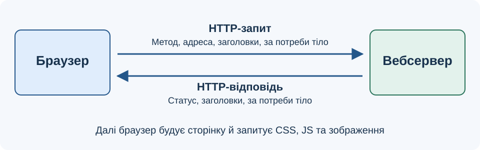
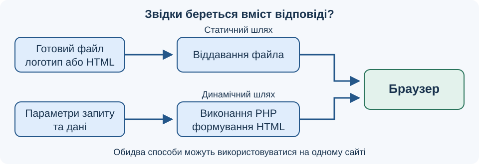
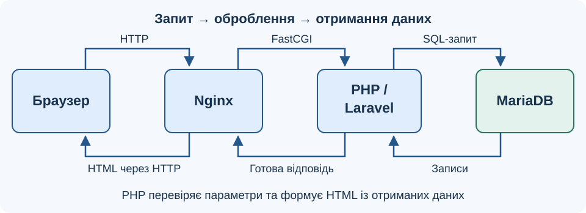
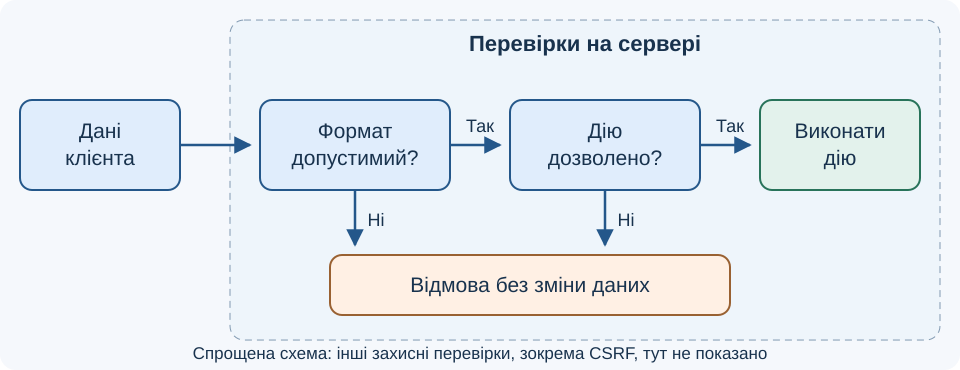

# Лекція 1. Вебсервери. Динамічні сайти. Серверні мови програмування

[Перелік лекцій](../README.md)

## Мета лекції

Пояснити взаємодію браузера й сервера, відмінність статичного та динамічного вмісту, призначення PHP, MariaDB і Laravel. Після опрацювання матеріалу студент має вміти простежити шлях запиту та визначити відповідальність кожного компонента вебзастосунку.

## 1. Як браузер отримує сторінку

**Клієнт** ініціює звернення до ресурсу, а **сервер** обробляє його й повертає відповідь. У вебі клієнтом часто є браузер. Слово «сервер» може означати як комп’ютер, так і програму, що обслуговує запити. Кілька серверних програм можуть працювати на одному комп’ютері.

Адреса `https://example.org/catalog?page=2` містить схему `https`, домен `example.org`, шлях `/catalog` і рядок параметрів `page=2`. Шлях може позначати маршрут застосунку, тому окремий файл `catalog` на диску не обов’язковий.

**Схема 1. Спрощений цикл обміну**

HTTP визначає правила такого обміну. HTTPS забезпечує захищене передавання HTTP за допомогою TLS. Захист каналу не замінює перевірки даних у програмі. Запит і відповідь можуть містити тіло; зокрема, відповідь на HEAD його не містить.

| Елемент HTTP | Що означає | Приклад |
| --- | --- | --- |
| Метод | Намір клієнта | GET — отримати ресурс; POST — передати дані для оброблення |
| Статус відповіді | Результат оброблення | 200 — успіх; 404 — ресурс не знайдено |
| Заголовок Content-Type | Формат вмісту | `text/html` або `application/json` |
| Тіло | Вміст повідомлення | HTML-сторінка, JSON або дані форми |

Сам HTTP не зберігає стан сеансу між запитами. Для розпізнавання користувача застосунок може використовувати сеанс та cookie з його ідентифікатором.

## 2. Статичний і динамічний вміст

**Статичний ресурс** сервер віддає як заздалегідь підготовлений файл. **Динамічну відповідь** формує програма, враховуючи запит, дані або права користувача. Наприклад, сторінка каталогу показує товари вибраної категорії, хоча шаблон сторінки залишається спільним.

| Ознака | Статичний вміст | Динамічний вміст |
| --- | --- | --- |
| Формування | До надходження запиту | Під час виконання програми; результат можна кешувати |
| Оновлення | Заміна готового файла | Зміна даних або логіки програми |
| Приклад | Логотип, CSS, HTML-довідка | Пошук, кошик, особистий кабінет |

Динамічність не означає наявність анімації. JavaScript може змінювати сторінку в браузері, а PHP — формувати її на сервері. Ці механізми можна поєднувати. База даних корисна для зберігання інформації, але не є обов’язковою умовою динамічної відповіді.

**Схема 2. Два способи підготовки відповіді**

Один сайт зазвичай поєднує обидва способи: логотип завантажується з файла, а список товарів формується програмою. Кешування дозволяє повторно використати готовий результат. Проте персональні сторінки не можна безумовно віддавати зі спільного кешу: відповідь має відповідати поточному користувачу.

## 3. Вебсервер і серверна програма

Вебсервер, наприклад Nginx або Apache HTTP Server, приймає запити, віддає статичні файли та передає оброблення динамічних ресурсів відповідному виконавцю. Він також веде журнали звернень і помилок. Nginx може взаємодіяти з PHP-FPM через FastCGI: Nginx обслуговує HTTP, а процеси PHP виконують програмний код.

**Схема 3. Формування каталогу на сервері**

Застосунок перевіряє параметри каталогу, отримує потрібні записи й формує HTML. За правильної конфігурації браузер отримує результат виконання, а не вихідний PHP-код. У цій архітектурі браузер не звертається до MariaDB безпосередньо.

## 4. Серверні мови та стек дисципліни

Серверну логіку пишуть різними мовами: PHP, Python, Java, C# або JavaScript у середовищі Node.js. Мову обирають разом із середовищем виконання та бібліотеками. HTML описує структуру документа, CSS — оформлення; вони не виконують роль серверної логіки.

| Компонент | Призначення в нашому стеку |
| --- | --- |
| PHP | Виконання серверного коду, оброблення даних і формування відповіді |
| MariaDB | Зберігання пов’язаних даних у таблицях та виконання SQL-запитів |
| Laravel | PHP-фреймворк для організації маршрутів, контролерів і подань |

У навчальному проєкті `lab-21/src/composer.json` задано PHP `^8.1` та Laravel `^10.10`; `composer.lock` фіксує Laravel 10.35.0. Це вимоги й зафіксована залежність проєкту, а не свідчення встановлених версій. **TODO: уточнити версії технологій** — фактичну PHP та MariaDB.

## 5. Межа довіри між клієнтом і сервером

Клієнтські дані можна змінити поза інтерфейсом, тому сервер перевіряє їхній формат і допустимість, а також право користувача виконувати дію. Перевірка форми в браузері лише допомагає користувачу.

Для звернень до бази застосовують параметризовані запити або відповідні засоби ORM; введення користувача не склеюють із SQL. Під час виведення тексту в HTML використовують контекстне екранування проти XSS. Дії зі зміною даних, що спираються на cookie автентифікації, потребують захисту від CSRF. Метод POST сам по собі такого захисту не надає.

**Схема 4. Перевірки перед виконанням дії**

Наприклад, у запиті на зміну кількості товару сервер перевіряє, чи є кількість допустимим цілим числом і чи належить кошик цьому користувачу. Коректний формат ще не означає дозволу на дію. Якщо хоча б одна перевірка не пройдена, зміни не виконують, а клієнту повертають зрозуміле повідомлення без внутрішніх деталей системи.

## Питання для самоперевірки

1. Чим вебсервер відрізняється від комп’ютера, на якому він працює?
2. Чому URL не обов’язково відповідає файлу на диску?
3. Чи може динамічна сторінка працювати без бази даних?
4. Які ролі виконують PHP, MariaDB і Laravel у схемі каталогу?
5. Чому перевірки форми в браузері недостатньо?

## Джерела

1. IETF. [RFC 9110: HTTP Semantics](https://www.rfc-editor.org/rfc/rfc9110.html).
2. Nginx. [Beginner’s Guide](https://nginx.org/en/docs/beginners_guide.html).
3. The PHP Documentation Group. [What is PHP and what can it do?](https://www.php.net/manual/en/introduction.php).
4. MariaDB. [Basics Guide](https://mariadb.com/docs/server/mariadb-quickstart-guides/basics-guide).
5. Laravel. [Request Lifecycle — Laravel 10.x](https://laravel.com/framework/docs/10.x/lifecycle).
