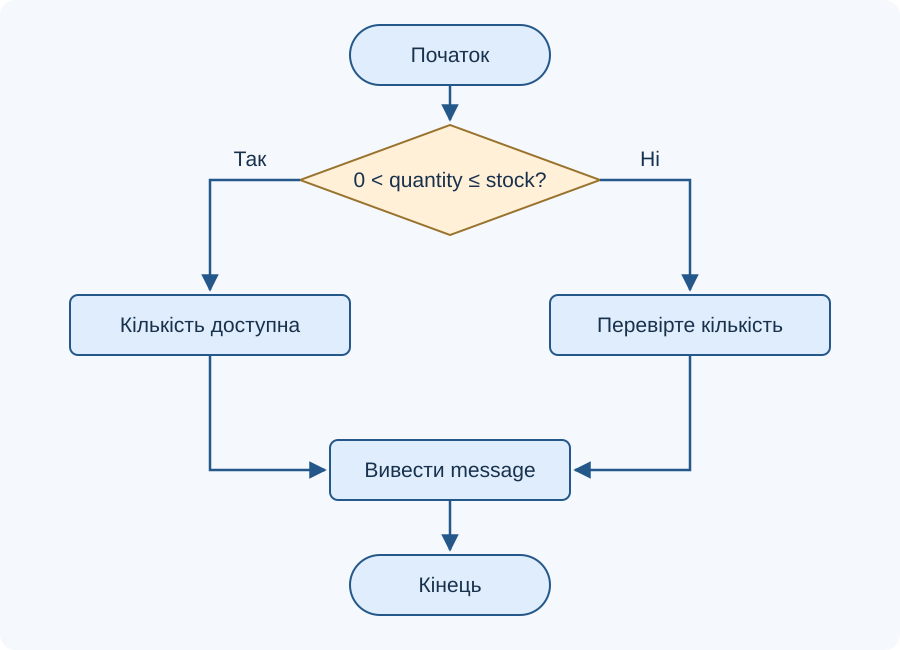
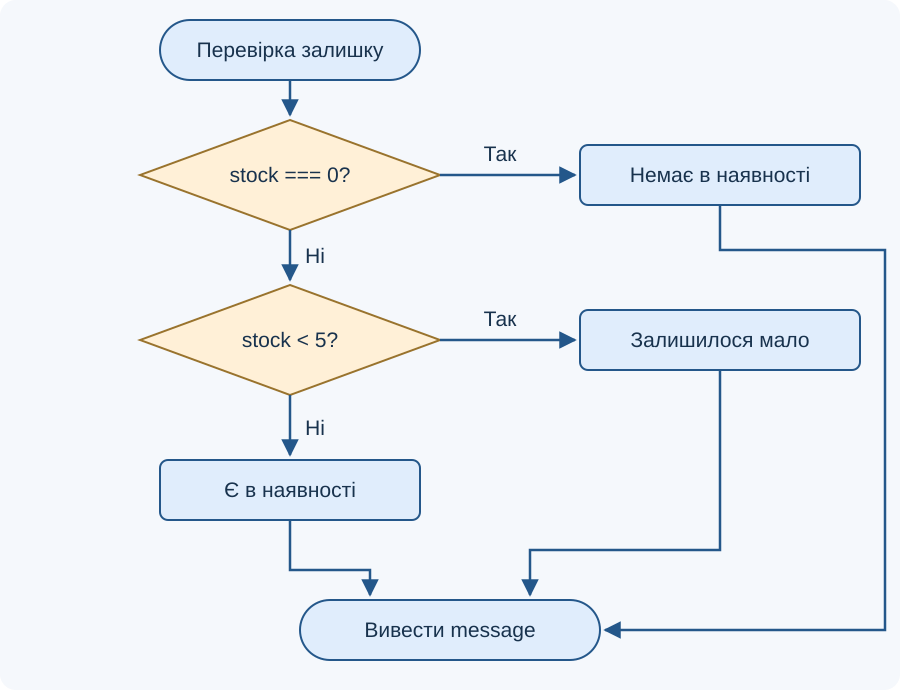
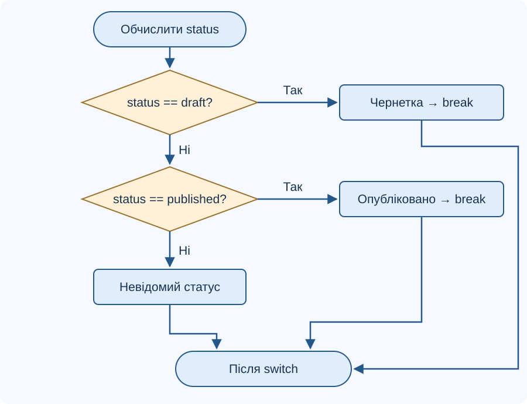

# Лекція 2. Основні конструкції мови PHP. Умовні оператори

[Перелік лекцій](../README.md)

## Мета лекції

Навчитися розрізняти типи значень, будувати логічні вирази та вибирати між `if`, `elseif` і `switch`. Після опрацювання матеріалу студент має вміти пояснити шлях виконання програми, накреслити розгалуження та перевірити його на граничних значеннях.

Приклади орієнтовано на PHP 8.1+ відповідно до вимоги `php: ^8.1` у навчальному проєкті `Лабораторні/lab-21/src/composer.json`. Там також задано Laravel `^10.10`; база даних і фреймворк для цих прикладів не потрібні. **TODO: уточнити версії технологій** — фактично встановлені PHP та MariaDB.

## 1. Змінні, типи та вирази

PHP-код починається тегом `<?php`. Інструкції зазвичай завершуються крапкою з комою, а блоки інструкцій обмежують фігурними дужками. У файлі, що містить лише PHP, закривний тег можна опустити. Назва змінної починається з `$`; регістр має значення: `$count` і `$Count` — різні змінні.

Оператор `=` присвоює значення. PHP має динамічну типізацію: тип пов’язаний зі значенням, а змінній можна присвоїти значення іншого типу. Це не скасовує правил перетворень і перевірок типів. Змінну потрібно визначити до першого читання на кожному можливому шляху виконання.

| Тип | Приклад значення | Призначення |
| --- | --- | --- |
| `int` | `12` | Ціла кількість |
| `float` | `12.5` | Число з рухомою комою |
| `string` | `'PHP'` | Текст |
| `bool` | `true`, `false` | Логічний результат |
| `null` | `null` | Відсутність значення |
| `array` | `['PHP', 'SQL']` | Набір елементів |
| `object` | `new stdClass()` | Об’єкт |

Це основні типи для вступу, а не повний перелік типів PHP. Значення та його тип зручно досліджувати через `var_dump()`. Коментар `//` пояснює код до кінця рядка й не виконується.

```php
<?php
$count = 3;
$limit = 5;
$hasSpace = $count < $limit;
var_dump($hasSpace); // bool(true)
```

## 2. Порівняння та логічні умови

Порівняння повертає логічне значення. `==` допускає перетворення типів, а `===` вимагає однакових типу та значення. Для передбачуваних перевірок використовуй строге порівняння, попередньо визначивши очікуваний тип даних. Наприклад, `5 == '5'` дає `true`, а `5 === '5'` — `false`.

| Оператори | Зміст | Приклад |
| --- | --- | --- |
| `===`, `!==` | Строга рівність і нерівність | `$role === 'editor'` |
| `<`, `<=`, `>`, `>=` | Порівняння величин | `$count >= 1` |
| `&&` | Обидві умови істинні | `$count >= 1 && $count <= 10` |
| `\|\|` | Хоча б одна умова істинна | `$isOwner \|\| $isAdmin` |
| `!` | Логічне заперечення | `!$isBlocked` |

Оператори `&&` та `||` обчислюють праву частину лише тоді, коли без неї результат ще невідомий. Це називають скороченим обчисленням. У виразі `$divisor !== 0 && 12 / $divisor > 2` за цілого нульового дільника ділення не виконується. Для складних умов використовуй дужки; `and` і `or` мають інший пріоритет, ніж `&&` та `||`.

В умові значення перетворюється на `bool`. Значення `false`, `0`, `0.0`, `-0.0`, `''`, `'0'`, `[]` і `null` стають `false`. Натомість рядки `'false'`, `'00'` та звичайний об’єкт `new stdClass()` стають `true`. Для деяких внутрішніх об’єктів існують спеціальні правила. Отже, твердження «об’єкт без властивостей завжди хибний» неправильне.

## 3. Неповне й повне розгалуження

`if` виконує блок, якщо умова істинна; інакше пропускає його. Додавання `else` задає альтернативний блок. У повному розгалуженні виконується рівно одна з двох гілок, після чого програма продовжується спільним шляхом.

```php
<?php
$stock = 4;
$quantity = 2;
if ($quantity > 0 && $quantity <= $stock) {
    $message = 'Кількість доступна';
} else {
    $message = 'Перевірте кількість';
}
echo $message;
```

Результат — `Кількість доступна`. Змінна `$message` визначена в обох гілках, тому її можна читати після розгалуження. Тут використовуються задані цілі числа; вхідні дані реального запиту спочатку потребують перевірки типу й допустимого діапазону.

**Блок-схема 1. Вибір однієї з двох дій**



На блок-схемах ромб позначає перевірку, прямокутник — дію, заокруглений блок — початок або кінець. Виходи з ромба підписано «Так» і «Ні». Для `if` без `else` гілка «Ні» одразу переходить до спільного продовження.

## 4. Кілька альтернатив: elseif

Ланцюжок `if … elseif … else` перевіряє умови зверху вниз і виконує лише першу істинну гілку. `else` спрацьовує, якщо всі попередні умови хибні. Кілька незалежних `if` мають іншу поведінку: кожна умова перевіряється окремо, тому можуть виконатися кілька блоків.

```php
<?php
$stock = 3;
if ($stock === 0) {
    $message = 'Немає в наявності';
} elseif ($stock < 5) {
    $message = 'Залишилося мало';
} else {
    $message = 'Є в наявності';
}
echo $message;
```

Передумова прикладу — `$stock` є невід’ємним цілим числом. Для `3` виводиться `Залишилося мало`. Якщо перевірку `$stock < 5` поставити першою, вона охопить і нуль: порядок умов змінить результат.

**Блок-схема 2. Послідовна перевірка альтернатив**



## 5. Вибір за значенням: switch

`switch` доречний, коли одне значення порівнюють із кількома варіантами `case`. Вираз перемикача обчислюється один раз; зіставлення виконується за правилами нестрогого порівняння. Тому типи варіантів потрібно узгоджувати. Для перевірок діапазонів зрозумілішим зазвичай є `if`.

```php
<?php
$status = 'draft';
switch ($status) {
    case 'draft':
        echo 'Чернетка';
        break;
    case 'published':
        echo 'Опубліковано';
        break;
    default:
        echo 'Невідомий статус';
}
```

Результат — `Чернетка`. `break` завершує виконання `switch`. Без нього виконання переходить до наступного блока навіть без збігу з його `case`. У цьому прикладі видалення першого `break` дасть `ЧернеткаОпубліковано`. `default` обробляє відсутність збігів. Не слід обирати `switch` на підставі твердження, що він завжди швидший за `elseif`.

**Блок-схема 3. Перемикач із завершенням кожної гілки**



Схема показує логіку саме наведеного прикладу з `break`; для навмисного переходу між `case` потрібні інші стрілки. Альтернативний запис перемикача починається `switch ($status):` і завершується `endswitch;`.

## 6. Умови в HTML і типові помилки

У шаблоні зручно застосовувати `if (...):`, `else:` та `endif;`. Для додаткових умов використовують `elseif (...):` одним словом. Не змішуй двокрапки та фігурні дужки в межах однієї конструкції.

```php
<?php $isAvailable = true; ?>
<?php if ($isAvailable): ?>
    <p>Товар доступний</p>
<?php else: ?>
    <p>Товар тимчасово відсутній</p>
<?php endif; ?>
```

У браузері буде показано лише перший абзац. Текст тут сталий; змінні дані в текстовому HTML-контексті слід екранувати через `htmlspecialchars($text, ENT_QUOTES | ENT_SUBSTITUTE, 'UTF-8')`. Умова сама по собі не захищає від XSS.

Не плутай `=` із `===`, не став `;` одразу після `if (...)` і використовуй фігурні дужки навіть для коротких гілок. Перевіряй не тільки звичайний випадок, а й межі: для залишку товару — `0`, `1`, `4`, `5`. Очікувані повідомлення відповідно: «Немає в наявності», двічі «Залишилося мало», «Є в наявності». Від’ємний залишок порушує передумову та має бути відхилений до цього розгалуження.

## Контрольні питання

1. Чим відрізняються присвоєння, нестроге та строге порівняння?
2. Який логічний результат мають рядки `'0'`, `'00'` і `'false'`?
3. Як скорочене обчислення може запобігти діленню на нуль?
4. Чим кілька незалежних `if` відрізняються від ланцюжка `elseif`?
5. Простежте блок-схему залишку для значень `0`, `4` та `5`.
6. Що станеться після видалення першого `break` у прикладі `switch`?
7. Чому `switch` потребує уваги до типів значень?
8. Як записати `if … else` альтернативним синтаксисом у HTML?
9. Чому змінна, створена лише в одній гілці, може спричинити помилку?
10. Які перевірки потрібні перед використанням кількості з HTTP-запиту?

## Джерела

1. The PHP Documentation Group. [if](https://www.php.net/manual/en/control-structures.if.php).
2. The PHP Documentation Group. [elseif/else if](https://www.php.net/manual/en/control-structures.elseif.php).
3. The PHP Documentation Group. [switch](https://www.php.net/manual/en/control-structures.switch.php).
4. The PHP Documentation Group. [Comparison Operators](https://www.php.net/manual/en/language.operators.comparison.php).
5. The PHP Documentation Group. [Booleans](https://www.php.net/manual/en/language.types.boolean.php).
6. The PHP Documentation Group. [Logical Operators](https://www.php.net/manual/en/language.operators.logical.php).
7. The PHP Documentation Group. [Alternative syntax for control structures](https://www.php.net/manual/en/control-structures.alternative-syntax.php).
8. The PHP Documentation Group. [htmlspecialchars](https://www.php.net/manual/en/function.htmlspecialchars.php).
