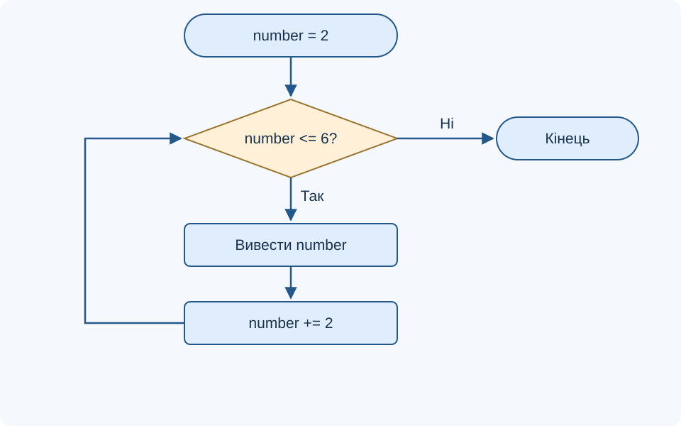
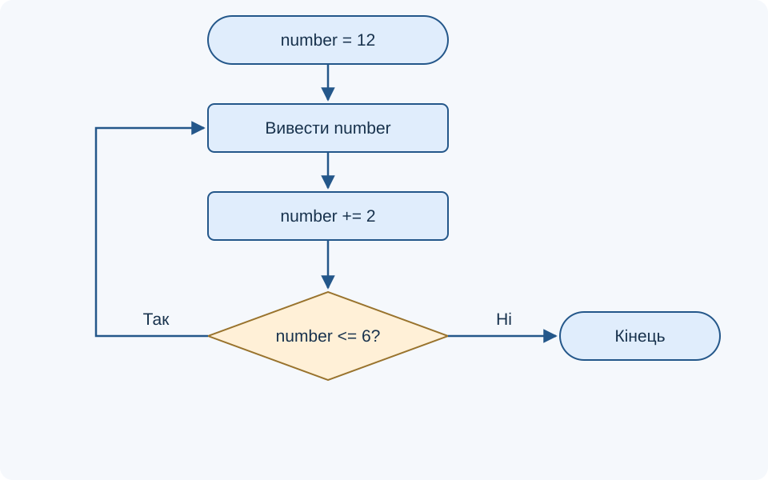
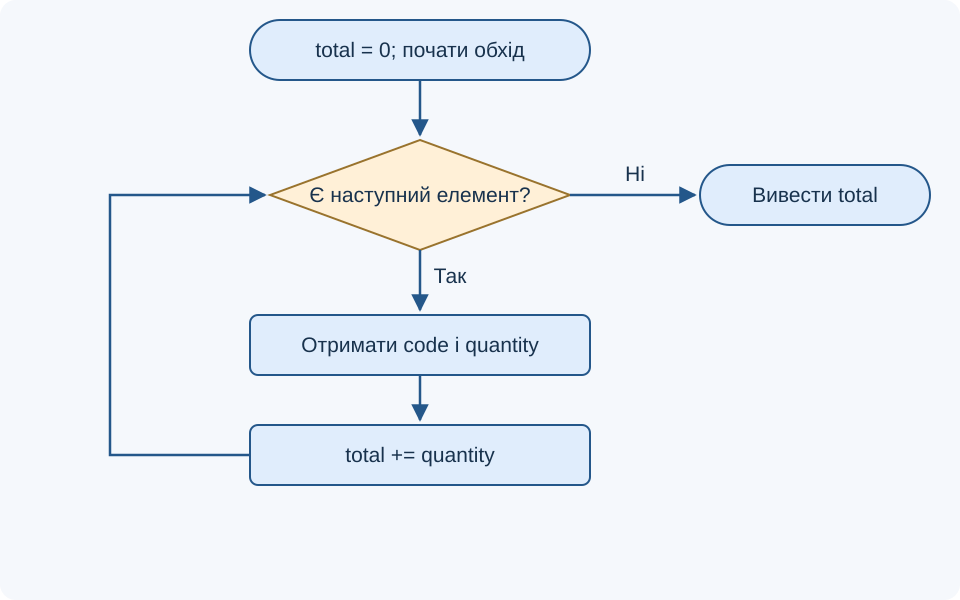

# Лекція 3. Основні конструкції мови PHP. Цикли. Масиви

[Перелік лекцій](../README.md)

## Мета лекції

Навчитися організовувати повторення, вибирати цикл за умовами задачі та обробляти масиви. Після опрацювання матеріалу студент має вміти простежити ітерації, пояснити завершення циклу, обчислити підсумок і знайти помилки в індексах.

Приклади розраховано на PHP 8.1+ за вимогою `php: ^8.1` навчального проєкту `Лабораторні/lab-21/src/composer.json`, де також задано Laravel `^10.10`. Для цієї теми Laravel і MariaDB не потрібні. **TODO: уточнити версії технологій** — фактично встановлені PHP та MariaDB.

## 1. Повторення та стан циклу

Цикл виконує тіло повторно; одне виконання тіла називають ітерацією. Перед початком визначають початковий стан, умову продовження та спосіб переходу до наступного стану. Наприклад, лічильник починається з нуля, збільшується на одиницю й має залишатися меншим за кількість елементів.

| Конструкція | Коли перевіряється умова | Типове застосування |
| --- | --- | --- |
| `while` | Перед кожною ітерацією | Повторення, кероване умовою |
| `do … while` | Після тіла | Потрібне щонайменше одне виконання |
| `for` | Після ініціалізації та перед тілом | Перебір числового діапазону |
| `foreach` | Перевіряється наявність наступного елемента | Перебір масиву або ітерованого об’єкта |

Умова має зрештою стати хибною або виконання має завершити `break`. Якщо лічильник не змінюється чи рухається в неправильний бік, цикл може стати нескінченним. Для серверного застосунку це означає зайві витрати ресурсів та відсутність своєчасної відповіді клієнту.

## 2. while і do … while

У `while` тіло може не виконатися жодного разу. У прикладі лічильник послідовно набуває значень `2`, `4`, `6`, після чого стає `8` і перевірка завершує повторення.

```php
<?php
$number = 2;
while ($number <= 6) {
    echo $number . ' ';
    $number += 2;
}
// Результат: 2 4 6
```

**Блок-схема 1. Цикл із передумовою**



У `do … while` перевірка стоїть після тіла. Тому початкова хибність умови не скасовує першої ітерації. Після закривної дужки умови потрібна крапка з комою.

```php
<?php
$number = 12;
do {
    echo $number . ' ';
    $number += 2;
} while ($number <= 6);
// Результат: 12
```

**Блок-схема 2. Цикл із післяумовою**



В обох схемах ромб означає умову, прямокутник — дію, заокруглений блок — початок або завершення. Зворотна стрілка показує повторення. За початкового значення `12` перший приклад нічого не виведе, а другий виведе `12`: саме місце перевірки визначає цю різницю.

## 3. for, break і continue

У заголовку `for` записують три частини: ініціалізацію, умову та крок. Ініціалізація виконується один раз. Після тіла виконується крок, потім знову перевіряється умова. У прикладі обчислюється сума перших чотирьох додатних цілих чисел.

```php
<?php
$total = 0;
for ($i = 1; $i <= 4; $i++) {
    $total += $i;
}
echo $total; // 10
```

Накопичувач `$total` потрібно ініціалізувати до циклу. Якщо присвоювати йому нуль у тілі, кожна ітерація втратить попередній результат. Для перевірки алгоритму корисно скласти трасувальну таблицю.

| Ітерація | `$i` | `$total` до додавання | `$total` після додавання |
| --- | ---: | ---: | ---: |
| 1 | 1 | 0 | 1 |
| 2 | 2 | 1 | 3 |
| 3 | 3 | 3 | 6 |
| 4 | 4 | 6 | 10 |

`break` завершує найближчий цикл, а `continue` пропускає решту поточної ітерації. У `for` після `continue` виконується крок, у `while` — одразу перевірка умови. Тому зміна лічильника після `continue` у тілі `while` може ніколи не відбутися.

```php
<?php
foreach ([0, 4, 7, 9] as $value) {
    if ($value === 0) {
        continue;
    }
    if ($value > 5) {
        echo $value;
        break;
    }
}
// Результат: 7 — перший придатний елемент
```

Без числа після `break` завершується лише найближча конструкція, а не всі вкладені цикли. Вкладення потрібне, наприклад, для обходу рядків і клітинок таблиці; якщо обидва цикли мають по `n` ітерацій, тіло внутрішнього виконається `n × n` разів.

## 4. Масив як відповідність ключів і значень

Масив PHP — упорядкована структура пар «ключ — значення». Ключі можуть бути цілими числами або рядками. Індексований список і асоціативний масив не є різними типами PHP: це різні способи використання `array`.

```php
<?php
$topics = ['PHP', 'HTTP'];
$topics[] = 'SQL';
$product = ['name' => 'Зошит', 'quantity' => 3];
echo $topics[0]; // PHP
echo $product['quantity']; // 3
```

У списку без явно заданих ключів нумерація починається з нуля. Запис `[]` додає елемент, а запис із конкретним ключем створює або замінює відповідну пару. Значення можуть бути вкладеними масивами, наприклад списком товарів із назвами та кількістю.

`count($topics)` повертає кількість елементів, а не найбільший ключ. Після `unset($topics[1])` залишаться ключі `0` і `2`: автоматичної перенумерації немає. Якщо потрібен новий послідовний список, застосовують `array_values($topics)`. Не припускай, що будь-який масив можна обійти індексами від нуля до `count(...) - 1`.

| Перевірка або операція | Результат |
| --- | --- |
| `$data['name'] ?? 'Без назви'` | Запасне значення, якщо ключ відсутній або містить `null` |
| `isset($data['name'])` | Чи існує значення, відмінне від `null` |
| `array_key_exists('name', $data)` | Чи існує ключ, навіть зі значенням `null` |
| `unset($data['name'])` | Видалення елемента |

Ключ `'8'` може бути перетворений на цілий `8`, тому він не створює незалежний елемент поруч із ключем `8`. Щоб уникати прихованого перезапису, використовуй однорідні, зрозумілі ключі. Для вкладених даних перевіряй також структуру внутрішнього масиву.

## 5. foreach і підсумовування даних

`foreach ($items as $value)` надає значення, а форма `$key => $value` — також ключ. Для порожнього масиву тіло не виконується. Зазвичай це найзручніший спосіб обходу, оскільки він не залежить від послідовності числових ключів.

```php
<?php
$stock = ['notebook' => 3, 'pen' => 5, 'folder' => 0];
$total = 0;
foreach ($stock as $code => $quantity) {
    $total += $quantity;
}
echo $total; // 8
```

**Блок-схема 3. Накопичення суми під час обходу**



Передумова прикладу — усі кількості є невід’ємними цілими числами. На кожному кроці `$total` дорівнює сумі вже оброблених значень. Така властивість допомагає пояснити правильність алгоритму; після останнього елемента накопичувач містить повну суму.

У звичайному обході присвоєння нового значення змінній `$quantity` не змінює елемент масиву. Для зміни використовують ключ, наприклад `$stock[$code] = $quantity + 1`. Існує обхід за посиланням `foreach ($stock as &$quantity)`, але після нього слід виконати `unset($quantity)`, щоб прибрати посилання на останній елемент.

## 6. Перевірка алгоритму

Перевіряй порожній масив, один елемент, нульові значення та пропуски ключів. Для підсумовування очікувані результати такі: `[]` → `0`, `[5]` → `5`, `[2 => 3, 7 => 4]` → `7`. Це виявляє помилки, які приховує звичайний послідовний список.

Не змінюй структуру масиву під час навчального обходу без чіткого розуміння наслідків; для відбору елементів простіше створити новий масив. Якщо значення надходять із запиту, спочатку перевіряй їхні типи й межі. Перед виведенням стороннього тексту в HTML потрібне контекстне екранування.

## Контрольні питання

1. Що називають ітерацією та які три складники керують повторенням?
2. Чим відрізняються `while` і `do … while` за початково хибної умови?
3. У якому порядку виконуються частини `for`?
4. Чому накопичувач ініціалізують до циклу?
5. Куди передає керування `continue` у `for` і `while`?
6. Чому `count()` не визначає найбільший ключ масиву?
7. Чим `isset()` відрізняється від `array_key_exists()`?
8. Простежте схему `foreach` для порожнього масиву та `[3, 5]`.
9. Навіщо викликати `unset()` після обходу за посиланням?
10. Які тестові дані виявлять помилку в межах індексів?

## Джерела

1. The PHP Documentation Group. [while](https://www.php.net/manual/en/control-structures.while.php).
2. The PHP Documentation Group. [do-while](https://www.php.net/manual/en/control-structures.do.while.php).
3. The PHP Documentation Group. [for](https://www.php.net/manual/en/control-structures.for.php).
4. The PHP Documentation Group. [foreach](https://www.php.net/manual/en/control-structures.foreach.php).
5. The PHP Documentation Group. [Arrays](https://www.php.net/manual/en/language.types.array.php).
6. The PHP Documentation Group. [continue](https://www.php.net/manual/en/control-structures.continue.php).
7. The PHP Documentation Group. [array_key_exists](https://www.php.net/manual/en/function.array-key-exists.php).
8. The PHP Documentation Group. [array_values](https://www.php.net/manual/en/function.array-values.php).
