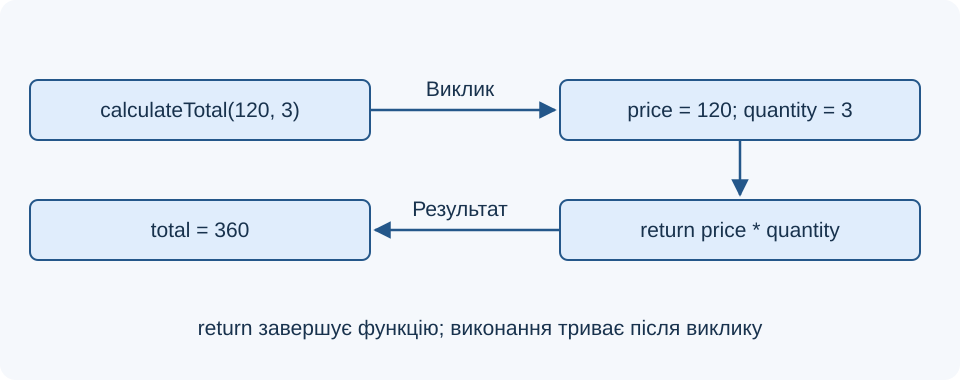
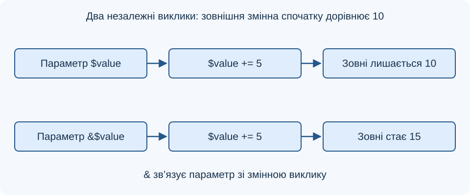
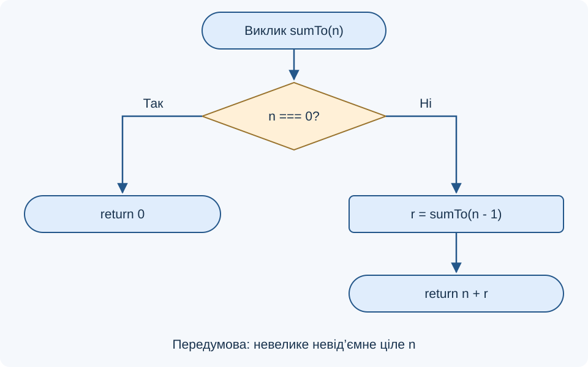

# Лекція 4. Робота з функціями у PHP. Створення користувацьких функцій

[Перелік лекцій](../README.md)

## Мета лекції

Навчитися створювати функції, задавати параметри й результат, пояснювати область видимості, передавання за значенням і посиланням та рекурсивні виклики.

Приклади орієнтовано на PHP 8.1+ за вимогою `php: ^8.1` у `Лабораторні/lab-21/src/composer.json`, де також зазначено Laravel `^10.10`. Фреймворк і база даних тут не потрібні. **TODO: уточнити версії технологій** — фактично встановлені PHP та MariaDB. Кожний блок PHP є окремим прикладом.

## 1. Оголошення, виклик і повернення

Функцію оголошують через `function`, а викликають за ім’ям з аргументами в дужках. Назва має пояснювати операцію; у прикладах використовуємо camelCase.

```php
<?php
declare(strict_types=1);
function calculateTotal(int $price, int $quantity): int
{
    return $price * $quantity;
}
$total = calculateTotal(120, 3);
echo $total; // 360
```

Тут `$price` і `$quantity` — параметри, а `120` і `3` — аргументи. Ціна задана цілим числом найменших грошових одиниць.

`return` завершує поточний виклик і передає значення в місце виклику. `echo` лише виводить дані: воно не замінює повернення результату. Функцію, яка повертає суму, можна використати в обчисленні, тесті або HTML-шаблоні. Якщо результат не повернуто, звичайна функція без оголошеного типу результату повертає `null`.

**Схема 1. Передавання аргументів і результату**



Звичайну іменовану функцію верхнього рівня можна викликати до її текстового оголошення. Для оголошення всередині умови або іншої функції спочатку має виконатися відповідний код. Не оголошуй ту саму функцію повторно під час виконання сценарію.

## 2. Типи та контракт функції

Контракт описує допустимі входи, результат і реакцію на помилки. Оголошення `int` перевіряє тип, але не гарантує додатності числа. Перевірку діапазону потрібно реалізувати окремо. `declare(strict_types=1);` розміщують на початку PHP-файла.

| Запис | Значення |
| --- | --- |
| `int $quantity` | Параметр цілого типу |
| `string $name` | Рядковий параметр |
| `?string $note` | Рядок або `null` |
| `: array` | Функція повертає масив |
| `: void` | Функція не повертає значення результату |

Для скалярних аргументів строгість визначає файл виклику. У строгому режимі передавання рядка `'3'` замість `int` спричиняє `TypeError`; ціле число допускається для параметра `float`. Не покладайся на неявне обрізання дробової частини: спочатку визнач, які дані дозволяє задача.

```php
<?php
declare(strict_types=1);
function calculateSubtotal(int $price, int $quantity): int
{
    if ($price < 0 || $quantity < 0) {
        throw new InvalidArgumentException('Значення мають бути невід’ємними');
    }
    return $price * $quantity;
}
echo calculateSubtotal(120, 0); // 0
```

Виняток повідомляє про порушення контракту. Не підмінюй його нулем, який є коректним результатом. Для великих чисел потрібні межі, що запобігають переповненню.

## 3. Необов’язкові й варіативні параметри

Значення за замовчуванням дозволяє пропустити аргумент. Обов’язкові параметри розміщують перед необов’язковими. Переданий `null` не означає автоматичного використання значення за замовчуванням: він має відповідати оголошеному типу.

```php
<?php
declare(strict_types=1);
function addDelivery(int $subtotal, int $delivery = 50): int
{
    return $subtotal + $delivery;
}
echo addDelivery(300); // 350
```

Параметр із `...` збирає решту аргументів у масив і має бути останнім. Під час виклику `...` може виконувати зворотну операцію — розгортати список в аргументи.

```php
<?php
declare(strict_types=1);
function sumQuantities(int ...$items): int
{
    $total = 0;
    foreach ($items as $item) {
        $total += $item;
    }
    return $total;
}
$quantities = [2, 3, 4];
echo sumQuantities(...$quantities); // 9
```

Виклик `sumQuantities()` поверне `0`. PHP підтримує й іменовані аргументи: `addDelivery(subtotal: 300, delivery: 0)`.

## 4. Значення, посилання та область видимості

За замовчуванням аргументи передаються за значенням. Зміна локального числа або елемента переданого масиву не змінює відповідну змінну виклику. Твердження «масиви автоматично передаються за посиланням» неправильне. PHP може відкладати фізичне копіювання масиву до його зміни.

```php
<?php
function appendLocal(array $items): array
{
    $items[] = 'SQL';
    return $items;
}
$topics = ['PHP'];
$expanded = appendLocal($topics);
echo count($topics); // 1
echo count($expanded); // 2
```

Символ `&` перед параметром створює посилання на змінну виклику. Це дозволяє змінити її без повернення нового значення, але робить побічний ефект менш очевидним. Об’єктні змінні поводяться інакше: копіюється ідентифікатор того самого об’єкта, тому зміна його властивостей видима зовні навіть без `&`. Це не тотожне передаванню змінної за посиланням.

**Схема 2. Звичайний параметр і параметр за посиланням**



Локальні змінні функції не доступні зовні; зовнішня змінна не стає локальною автоматично. `global $value` зв’язує ім’я всередині функції зі змінною глобальної області. Для явних залежностей зручніше передати значення параметром і повернути результат.

Локальна змінна `static` зберігає значення між викликами в межах виконання сценарію. Це може бути лічильник, але не заміна сесії чи бази даних. У звичайному окремому вебзапиті сценарій починає роботу заново; довготривалі процеси потребують окремого контролю стану.

## 5. Кілька результатів та анонімні функції

Функція може повернути кілька результатів як один масив з іменованими ключами.

```php
<?php
function describeSize(int $bytes): array
{
    return ['bytes' => $bytes, 'kibibytes' => $bytes / 1024];
}
$size = describeSize(2048);
echo $size['kibibytes']; // 2
```

Одиниця з основою 1024 — кібібайт (KiB). Передумова — невід’ємний розмір.

Анонімну функцію можна присвоїти змінній і викликати через неї. Замикання отримує зовнішню змінну через `use`: без `&` захоплюється її значення на момент створення, із `&` — посилання. Для об’єктного значення захоплення не створює копію самого об’єкта.

```php
<?php
$step = 2;
$increase = function (int $value) use ($step): int {
    return $value + $step;
};
$step = 10;
echo $increase(3); // 5
```

## 6. Рекурсія та перевірка функцій

Рекурсія — виклик функцією самої себе. Потрібні базовий випадок і зміна аргументу, що наближає до нього. Для демонстрації підсумуємо числа від `1` до `n`; передумова — невелике невід’ємне ціле `n`.

```php
<?php
function sumTo(int $n): int
{
    if ($n === 0) {
        return 0;
    }
    return $n + sumTo($n - 1);
}
echo sumTo(3); // 6
```

**Схема 3. Рекурсивне обчислення суми**



Виклики утворюють ланцюжок `sumTo(3) → sumTo(2) → sumTo(1) → sumTo(0)`. Повернення йде у зворотному напрямку: `0`, `1`, `3`, `6`. Від’ємний аргумент порушить передумову; без перевірки він не наблизиться до нуля. Глибока рекурсія витрачає пам’ять на виклики, тому для простого підсумовування доречний і цикл.

Для перевірки `calculateSubtotal` очікуємо `360` при `(120, 3)`, `0` при `(120, 0)` та виняток при `(120, -1)`.

## Контрольні питання

1. Чим параметр відрізняється від аргументу, а `return` — від `echo`?
2. Які правила не забезпечує сама декларація типу `int`?
3. Де визначається строгість перевірки скалярних аргументів?
4. Як працюють значення за замовчуванням і параметр із `...`?
5. Чому зміна масиву в `appendLocal()` не змінює `$topics`?
6. Чим об’єктний аргумент відрізняється від посилання `&`?
7. Яка різниця між локальною, глобальною та статичною змінною?
8. Чому замикання в прикладі додає `2`, хоча `$step` уже дорівнює `10`?
9. Простежте виклики й повернення `sumTo(2)`.
10. Які граничні значення перевіряють контракт функції обчислення суми?

## Джерела

1. The PHP Documentation Group. [User-defined functions](https://www.php.net/manual/en/functions.user-defined.php).
2. The PHP Documentation Group. [Function parameters and arguments](https://www.php.net/manual/en/functions.arguments.php).
3. The PHP Documentation Group. [Returning values](https://www.php.net/manual/en/functions.returning-values.php).
4. The PHP Documentation Group. [Type declarations](https://www.php.net/manual/en/language.types.declarations.php).
5. The PHP Documentation Group. [Variable scope](https://www.php.net/manual/en/language.variables.scope.php).
6. The PHP Documentation Group. [Anonymous functions](https://www.php.net/manual/en/functions.anonymous.php).
7. The PHP Documentation Group. [Objects and references](https://www.php.net/manual/en/language.oop5.references.php).
