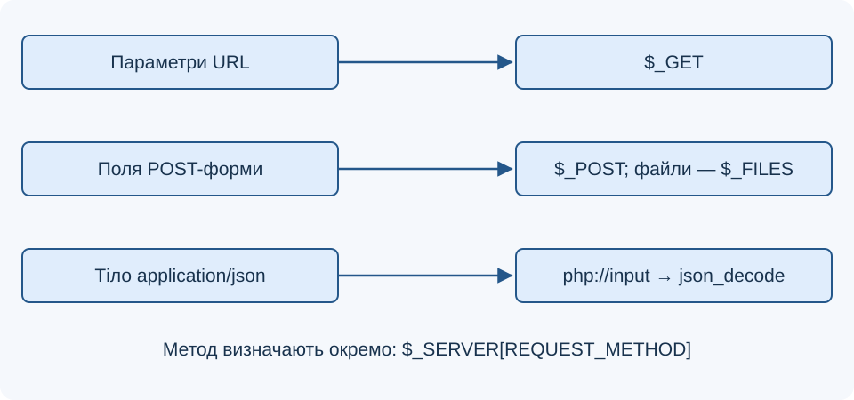
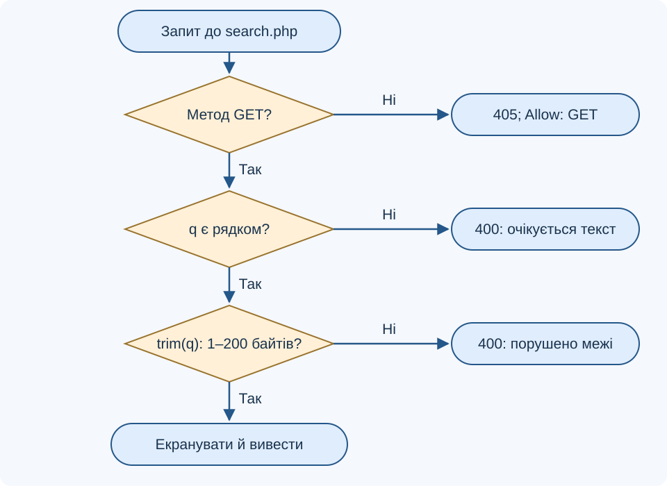
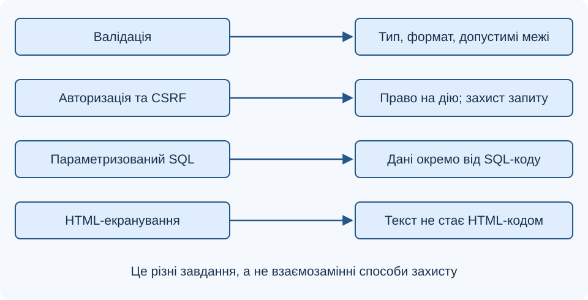

# Лекція 5. Обробка HTTP-запитів у PHP: методи та суперглобальні масиви

[Перелік лекцій](../README.md)

## Мета лекції

Навчитися вибирати метод, перевіряти вхідні дані й формувати відповідь; розрізняти URL-параметри, поля форми та JSON, валідацію, екранування й контроль доступу.

Приклади — для PHP 8.1+ у вебсередовищі: у `Лабораторні/lab-21/src/composer.json` задано PHP `^8.1`, Laravel `^10.10`. **TODO: уточнити версії технологій** — встановлені PHP та MariaDB. PHP-блоки є окремими обробниками.

## 1. Від повідомлення до даних програми

У HTTP/1.1 запит містить початковий рядок із методом і ціллю, заголовки та необов’язкове тіло, відділене порожнім рядком. HTTP/2 та HTTP/3 мають інше подання повідомлень зі збереженням семантики методів.

```http
GET /search.php?q=php HTTP/1.1
Host: example.org
Accept: text/html

```

`Content-Type` описує формат вмісту, `Accept` — бажані формати відповіді. POST може передавати форму або JSON, які PHP обробляє по-різному.

**Схема 1. Звідки PHP отримує дані**



## 2. GET, POST та інші методи

Безпечний метод не просить змінити стан ресурсу. Ідемпотентність означає однаковий задуманий вплив повторних запитів, хоча відповіді можуть відрізнятися.

| Метод | Призначення | Безпечний | Ідемпотентний |
| --- | --- | --- | --- |
| GET | Отримати представлення ресурсу | Так | Так |
| POST | Передати дані для оброблення | Ні | Загалом ні |
| PUT | Створити або замінити ресурс за відомою адресою | Ні | Так |
| PATCH | Передати інструкції часткової зміни | Ні | Залежить від операції |
| DELETE | Видалити зв’язок адреси з ресурсом | Ні | Так |
| HEAD | Отримати метадані без тіла відповіді | Так | Так |
| OPTIONS | Дізнатися про можливості взаємодії | Так | Так |

TRACE відображає запит для діагностики, CONNECT встановлює тунель. HTML-форми надсилають GET або POST; інші методи доступні через HTTP-клієнт, зокрема `fetch()`.

POST не шифрує дані: потрібен HTTPS. Паролі не передають у URL, що зберігається в історії та журналах. GET не використовують для видалення. Повторний POST може створити дубль операції.

## 3. Суперглобальні масиви

Суперглобальні змінні доступні у функціях без `global`. Клієнтські дані в них потребують перевірки.

| Змінна | Дані та особливості |
| --- | --- |
| `$_GET` | Параметри URL незалежно від HTTP-методу |
| `$_POST` | Поля стандартної POST-форми, не довільне тіло |
| `$_FILES` | Відомості про завантажені файли |
| `$_SERVER` | Метод, відомості про сервер і запит |
| `$_COOKIE` | Cookie, отримані в поточному запиті |
| `$_SESSION` | Дані сеансу після його запуску |
| `$_REQUEST` | Суміш джерел, склад і порядок залежать від налаштувань |
| `$_ENV` | Доступні змінні середовища |
| `$GLOBALS` | Доступ до змінних глобальної області |

POST на `/save.php?page=2` має параметр у `$_GET` і може мати поля в `$_POST`. Обирай джерело явно: склад `$_REQUEST` залежить від `request_order` і `variables_order`.

Поле `q[]` утворює масив. Вираз `$_GET['q'] ?? ''` задає запасне значення, але не перевіряє тип. Клієнтські заголовки в `$_SERVER` також потребують перевірки.

## 4. Форма та валідація

GET-форма додає поля до URL. `name` визначає ключ; `required` не замінює серверної перевірки.

```html
<form action="search.php" method="get">
    <label>Запит: <input name="q" required></label>
    <button type="submit">Знайти</button>
</form>
```

Обробник `search.php` перевіряє й відображає запит без звернення до бази.

```php
<?php
header('Content-Type: text/html; charset=UTF-8');
if (($_SERVER['REQUEST_METHOD'] ?? '') !== 'GET') {
    http_response_code(405);
    header('Allow: GET');
    exit('Метод не підтримується');
}
$query = $_GET['q'] ?? '';
if (!is_string($query)) {
    http_response_code(400);
    exit('Очікується текст');
}
$query = trim($query);
if ($query === '' || strlen($query) > 200) {
    http_response_code(400);
    exit('Потрібен непорожній запит до 200 байтів');
}
echo 'Пошук: ' . htmlspecialchars(
    $query, ENT_QUOTES | ENT_SUBSTITUTE, 'UTF-8'
);
```

`strlen()` рахує байти, а не українські літери; це навмисне обмеження цього прикладу. Для числового поля після перевірки рядкового типу можна застосувати `filter_var($value, FILTER_VALIDATE_INT)` і перевірити результат через `=== false`: нуль не є помилкою сам по собі. Діапазон визначають правила задачі.

**Блок-схема 2. Обробник пошуку**



## 5. POST-форми, JSON і файли

Для POST-форми типовий формат — `application/x-www-form-urlencoded`. Формат `multipart/form-data` використовують, зокрема, для файлів; поля опиняються в `$_POST`, відомості про файли — у `$_FILES`. Формат `text/plain` існує, але не забезпечує звичайного автоматичного розбору полів у `$_POST`.

JSON читають із `php://input`. Обробник приймає об’єкт із рядком `message` та повертає текст без збереження.

```php
<?php
header('Content-Type: text/plain; charset=UTF-8');
if (($_SERVER['REQUEST_METHOD'] ?? '') !== 'POST') {
    http_response_code(405);
    header('Allow: POST');
    exit('Потрібен POST');
}
$type = strtolower(trim(explode(';', $_SERVER['CONTENT_TYPE'] ?? '')[0]));
if ($type !== 'application/json') {
    http_response_code(415);
    exit('Потрібен application/json');
}
$body = file_get_contents('php://input');
if ($body === false) {
    http_response_code(400);
    exit('Тіло не прочитано');
}
try {
    $data = json_decode($body, false, 32, JSON_THROW_ON_ERROR);
} catch (JsonException $error) {
    http_response_code(400);
    exit('Некоректний JSON');
}
if (!$data instanceof stdClass || !is_string($data->message ?? null)) {
    http_response_code(400);
    exit('Потрібен об’єкт із рядком message');
}
$message = trim($data->message);
if ($message === '' || strlen($message) > 200) {
    http_response_code(400);
    exit('Повідомлення має містити 1–200 байтів');
}
echo $message;
```

Розмір тіла обмежують на сервері. У PHP 8.1 для PUT, PATCH і DELETE тіло обробляють явно, не через `$_POST`.

Для завантаження файла перевіряють `error`, розмір і фактичний тип. Клієнтським `name` та `type` не довіряють. Після перевірок файл переміщують через `move_uploaded_file()` до контрольованого каталогу під згенерованим ім’ям; завантажений код не повинен виконуватися сервером.

## 6. Відповідь, сеанс і захист

Статус і заголовки задають до виведення. `200` означає успіх, `201` — створення, `204` — успіх без тіла, `400` — неприйнятні дані, `405` із `Allow` — непідтримуваний метод, `415` — формат.

Cookie надходять від браузера, а сеанс пов’язує запити із серверними даними через ідентифікатор. `session_start()` викликають до виведення. `setcookie()` надсилає заголовок відповіді й не змінює автоматично `$_COOKIE` поточного запиту.

**Схема 3. Різні завдання захисних перевірок**



Валідація перевіряє дані, авторизація — право на дію. Для операцій зі зміною стану, що спираються на cookie автентифікації, застосовують CSRF-захист: зокрема, перевірений сервером токен. POST і HTTPS самі по собі його не замінюють.

HTML-екранування захищає відповідний контекст виведення від XSS, але не захищає SQL. До MariaDB звертаються параметризованими запитами або відповідними засобами ORM. Приклади цієї лекції не змінюють дані; додавання збереження потребуватиме цих окремих перевірок.

## Контрольні питання

1. Чим метод відрізняється від `Content-Type`?
2. Що означають безпечність та ідемпотентність методу?
3. Чи може POST-запит одночасно заповнювати `$_GET`?
4. Чому JSON не слід шукати в `$_POST`?
5. Як поле `q[]` вплине на перевірки обробника?
6. Чому `=== false` важливе для перевірки цілого числа?
7. Що означають відповіді `400`, `405` і `415`?
8. Яким даним завантаженого файла не можна довіряти?
9. Чим cookie відрізняється від даних сеансу?
10. Чому валідація, CSRF-захист і HTML-екранування не замінюють одне одного?

## Джерела

1. IETF. [RFC 9110: HTTP Semantics](https://www.rfc-editor.org/rfc/rfc9110.html).
2. IETF. [RFC 5789: PATCH Method for HTTP](https://www.rfc-editor.org/rfc/rfc5789.html).
3. MDN Web Docs. [HTTP request methods](https://developer.mozilla.org/en-US/docs/Web/HTTP/Reference/Methods).
4. MDN Web Docs. [Sending form data](https://developer.mozilla.org/en-US/docs/Learn_web_development/Extensions/Forms/Sending_and_retrieving_form_data).
5. The PHP Documentation Group. [Superglobals](https://www.php.net/manual/en/language.variables.superglobals.php).
6. The PHP Documentation Group. [$_GET](https://www.php.net/manual/en/reserved.variables.get.php).
7. The PHP Documentation Group. [$_POST](https://www.php.net/manual/en/reserved.variables.post.php).
8. The PHP Documentation Group. [$_FILES](https://www.php.net/manual/en/reserved.variables.files.php).
9. The PHP Documentation Group. [$_REQUEST](https://www.php.net/manual/en/reserved.variables.request.php).
10. The PHP Documentation Group. [POST method uploads](https://www.php.net/manual/en/features.file-upload.post-method.php).
11. The PHP Documentation Group. [php://](https://www.php.net/manual/en/wrappers.php.php).
12. The PHP Documentation Group. [json_decode](https://www.php.net/manual/en/function.json-decode.php).
13. The PHP Documentation Group. [filter_var](https://www.php.net/manual/en/function.filter-var.php).
14. OWASP. [Cross-Site Request Forgery Prevention Cheat Sheet](https://cheatsheetseries.owasp.org/cheatsheets/Cross-Site_Request_Forgery_Prevention_Cheat_Sheet.html).
