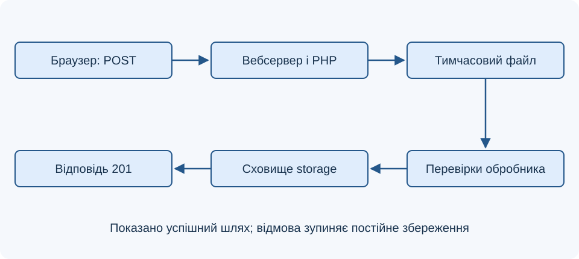
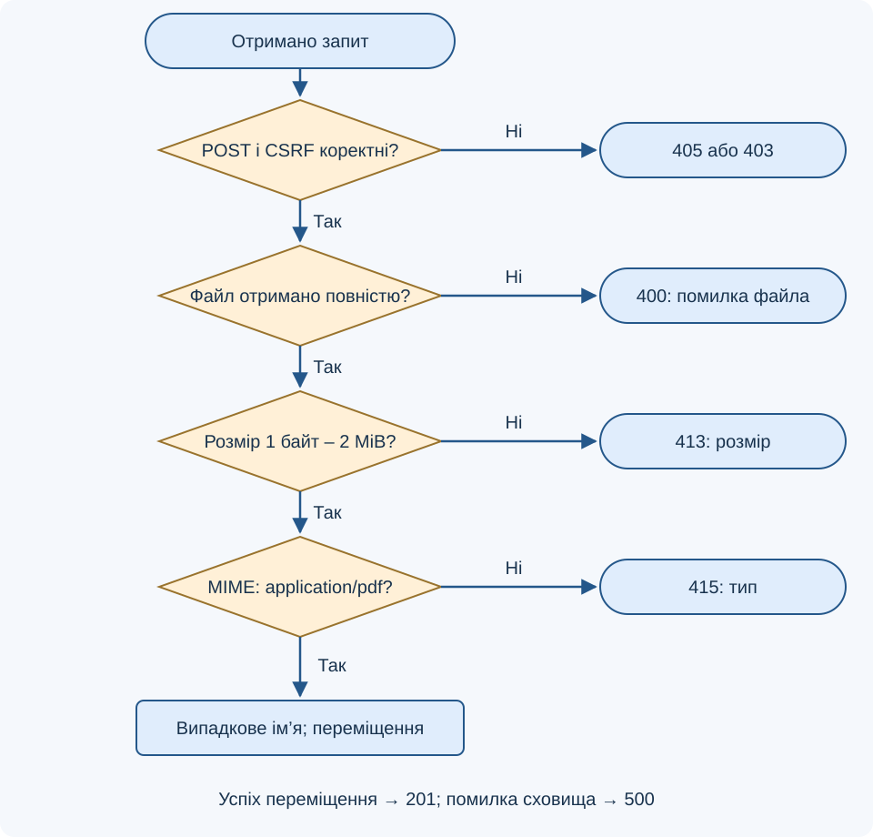
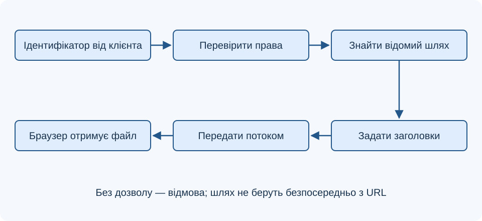

# Лекція 6. Обмін великими обсягами даних із сервером

[Перелік лекцій](../README.md)

## Мета лекції

Навчитися приймати файли через POST, узгоджувати ліміти, перевіряти й зберігати завантаження та пояснювати віддавання великих даних.

Орієнтир — PHP 8.1+ відповідно до `php: ^8.1` у `Лабораторні/lab-21/src/composer.json`, де задано Laravel `^10.10`. Приклади не потребують фреймворку чи MariaDB. Потрібне розширення Fileinfo. **TODO: уточнити версії технологій** — встановлені PHP та MariaDB.

## 1. Що змінюється зі збільшенням обсягу

Великий файл займає канал, сховище й час. Читання цілого файла в рядок витрачає пам’ять PHP. Запит може відхилити вебсервер або проксі ще до обробника.

Для файлів HTML-форма використовує POST і `multipart/form-data`. Кожне поле та файл передаються окремою частиною тіла; браузер формує роздільник `boundary`. Назва поля визначає ключ у `$_FILES`, а не адресу збереження на диску.

**Схема 1. Шлях завантаженого файла**



Непереміщений тимчасовий файл видаляється наприкінці запиту. Успіх передавання ще не означає дозволу на зберігання чи показ файла.

## 2. Узгодження обмежень

| Директива PHP | Що контролює |
| --- | --- |
| `file_uploads` | Дозвіл приймання файлів |
| `upload_max_filesize` | Межу для одного файла |
| `post_max_size` | Розмір усього POST-тіла |
| `upload_tmp_dir` | Тимчасовий каталог |
| `max_file_uploads` | Кількість файлів за один запит |
| `max_input_time` | Час розбору вхідних даних; поведінка залежить від середовища |

Приклад для файла до 2 MiB: `upload_max_filesize = 2M`, `post_max_size = 3M`. Загальна межа враховує поля й службову розмітку. Ці навчальні значення узгоджують із лімітами вебсервера, квотами й тайм-аутами.

За перевищення `post_max_size` масиви `$_POST` і `$_FILES` можуть бути порожніми. Причину уточнюють у журналах сервера. Поле `MAX_FILE_SIZE` й атрибут `accept` не є захистом: клієнт може їх змінити.

## 3. Метадані та коди помилок

| Поле `$_FILES['document']` | Як використовувати |
| --- | --- |
| `error` | Перевірити перед доступом до файла |
| `tmp_name` | Тимчасовий серверний шлях |
| `size` | Розмір у байтах; додатково можна перевірити сам файл |
| `name` | Клієнтська назва, непридатна як довірений шлях |
| `type` | Заявлений клієнтом MIME-тип, потребує незалежної перевірки |

`UPLOAD_ERR_OK` означає успіх передавання; `UPLOAD_ERR_NO_FILE` — файл не надіслано; `UPLOAD_ERR_INI_SIZE` і `UPLOAD_ERR_FORM_SIZE` — перевищено відповідні межі; `UPLOAD_ERR_PARTIAL` — передано лише частину. Відсутність тимчасового каталогу та помилка запису мають коди `UPLOAD_ERR_NO_TMP_DIR` і `UPLOAD_ERR_CANT_WRITE`.

Перевіряй також форму масиву: замість одного файла клієнт може надіслати вкладені поля. Не виводь `print_r($_FILES)` у відповідь користувачу: технічні шляхи потрібні журналу діагностики, а не інтерфейсу.

## 4. Приклад приймання PDF

Створи сусідні каталоги `public` і `storage`. Файли `form.php` та `upload.php` розмісти в `public`, який є коренем вебсервера. `storage` має бути доступним PHP для запису без прямої вебадреси. Локальний приклад приймає PDF до 2 MiB; спільний сервіс також потребує автентифікації, прав доступу та квот.

Файл `form.php` створює CSRF-токен сеансу:

```php
<?php
session_start();
$_SESSION['csrf'] ??= bin2hex(random_bytes(32));
?>
<form action="upload.php" method="post" enctype="multipart/form-data">
    <input type="hidden" name="csrf" value="<?= htmlspecialchars(
        $_SESSION['csrf'], ENT_QUOTES, 'UTF-8'
    ) ?>">
    <label>PDF: <input type="file" name="document" accept=".pdf" required></label>
    <button type="submit">Завантажити</button>
</form>
```

Обробник `upload.php` перевіряє запит і файл. CSRF-токен не замінює авторизацію.

```php
<?php
session_start();
header('Content-Type: text/plain; charset=UTF-8');
function fail(int $status, string $message): never
{
    http_response_code($status);
    exit($message);
}
if (($_SERVER['REQUEST_METHOD'] ?? '') !== 'POST') {
    header('Allow: POST');
    fail(405, 'Потрібен POST');
}
$token = $_POST['csrf'] ?? null;
$expected = $_SESSION['csrf'] ?? null;
if (!is_string($token) || !is_string($expected)
    || !hash_equals($expected, $token)) {
    fail(403, 'Запит не підтверджено');
}
session_write_close();
$file = $_FILES['document'] ?? null;
if (!is_array($file) || !is_int($file['error'] ?? null)) {
    fail(400, 'Некоректне поле файла');
}
if ($file['error'] !== UPLOAD_ERR_OK) {
    fail(400, 'Файл не отримано повністю');
}
$tmp = $file['tmp_name'] ?? null;
if (!is_string($tmp) || !is_uploaded_file($tmp)) {
    fail(400, 'Некоректне завантаження');
}
$size = filesize($tmp);
if ($size === false || $size < 1 || $size > 2 * 1024 * 1024) {
    fail(413, 'Розмір має бути від 1 байта до 2 MiB');
}
$mime = (new finfo(FILEINFO_MIME_TYPE))->file($tmp);
if ($mime !== 'application/pdf') {
    fail(415, 'Дозволено лише PDF');
}
$name = bin2hex(random_bytes(16)) . '.pdf';
$target = dirname(__DIR__) . '/storage/' . $name;
if (!move_uploaded_file($tmp, $target)) {
    fail(500, 'Не вдалося зберегти файл');
}
http_response_code(201);
echo 'Файл прийнято';
```

**Блок-схема 2. Перевірки перед збереженням**



`move_uploaded_file()` перевіряє, що джерело є HTTP-завантаженням. Воно може перезаписати наявну ціль, тому ім’я створюється сервером із випадкових байтів, а не береться з `name`. `basename()` саме по собі не вирішує проблеми типу вмісту чи конфлікту імен.

Fileinfo визначає тип за вмістом, але не доводить нешкідливість. Перед публікацією можуть знадобитися карантин і спеціалізована перевірка. Для архівів контролюють також розмір після розпакування.

## 5. Кілька файлів та великі передачі

Поле `name="documents[]"` із `multiple` утворює масиви: `$_FILES['documents']['error'][$i]`, `tmp_name[$i]` тощо. Для кожного індексу повторюють усі перевірки, обмежують кількість і сумарний розмір. Треба заздалегідь визначити, чи дозволено частковий успіх, і повідомити результат для кожного файла.

Для дуже великих об’єктів застосунок може передавати частини з ідентифікатором завантаження та номером фрагмента. Сервер контролює належність частин користувачу, загальний обсяг і завершеність; повторний фрагмент не повинен дублювати дані. PHP не надає такого протоколу автоматично. Покинуті тимчасові частини потрібно прибирати за визначеною політикою.

## 6. Віддавання даних клієнту

Великі файли не обов’язково читати через `file_get_contents()` у повний рядок. `readfile()` передає файл у вихідний потік, але буферизація PHP, проксі та вебсервера може впливати на пам’ять і затримки. Для великих сховищ віддавання часто доручають вебсерверу після перевірки доступу застосунком.

**Схема 3. Контрольоване завантаження із сервера**



Клієнт передає ідентифікатор, а сервер зіставляє його з відомим шляхом. Не можна підставляти довільний параметр URL у файловий шлях. До виведення задають правильний `Content-Type` і, для вкладення, `Content-Disposition`. Для приватних документів перевіряють власника та правила кешування.

Перевір відсутній, порожній, завеликий файл, неправильний тип, підміну токена й недоступне сховище. Успіх створює файл у `storage`, відмова — ні.

## Контрольні питання

1. Навіщо формі `multipart/form-data`?
2. Чим `post_max_size` відрізняється від `upload_max_filesize`?
3. Чому порожній `$_FILES` не завжди означає відсутність вибору?
4. Яке поле файла перевіряють першим і чому?
5. Чому не можна довіряти `name`, `type` та `accept`?
6. Що перевіряє `move_uploaded_file()` і чого воно не гарантує?
7. Навіщо потрібні випадкове ім’я та непублічне сховище?
8. Як змінюється структура `$_FILES` для кількох файлів?
9. Які додаткові правила потрібні для передавання частинами?
10. Чому під час віддавання файла перевіряють ідентифікатор і права доступу?

## Джерела

1. The PHP Documentation Group. [POST method uploads](https://www.php.net/manual/en/features.file-upload.post-method.php).
2. The PHP Documentation Group. [Error Messages Explained](https://www.php.net/manual/en/features.file-upload.errors.php).
3. The PHP Documentation Group. [Core php.ini directives](https://www.php.net/manual/en/ini.core.php).
4. The PHP Documentation Group. [move_uploaded_file](https://www.php.net/manual/en/function.move-uploaded-file.php).
5. The PHP Documentation Group. [finfo_file](https://www.php.net/manual/en/function.finfo-file.php).
6. The PHP Documentation Group. [readfile](https://www.php.net/manual/en/function.readfile.php).
7. OWASP. [File Upload Cheat Sheet](https://cheatsheetseries.owasp.org/cheatsheets/File_Upload_Cheat_Sheet.html).
