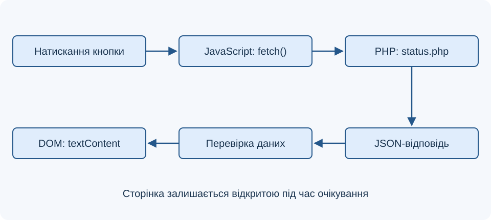
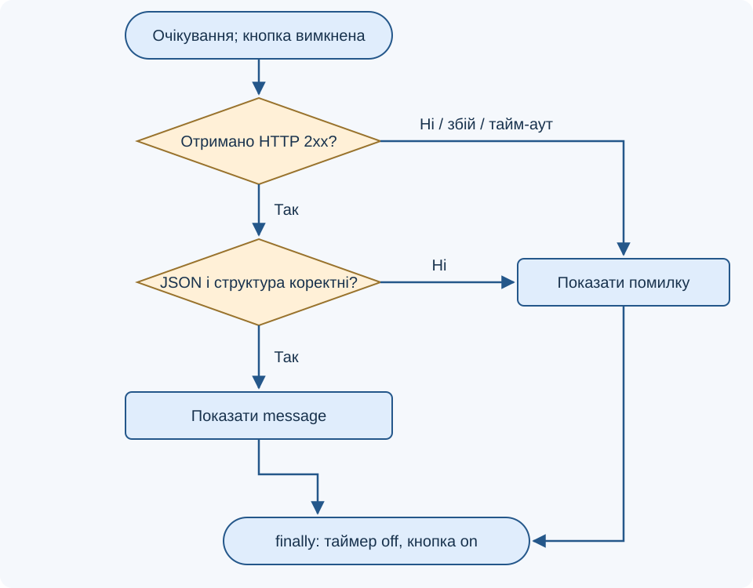
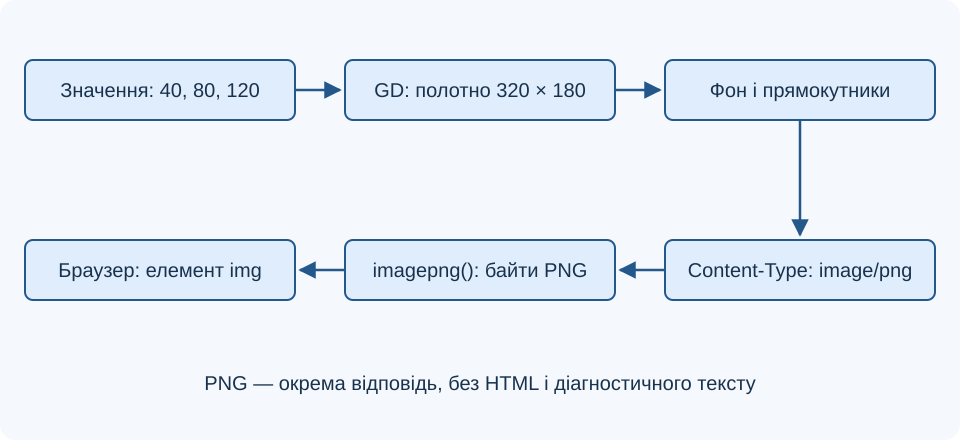

# Лекція 7. Асинхронне передавання даних. Оброблення графіки

[Перелік лекцій](../README.md)

## Мета лекції

Навчитися отримувати дані асинхронно, керувати станами інтерфейсу, перевіряти JSON, розрізняти помилки та формувати графічну відповідь у PHP.

Приклади — для PHP 8.1+: у `Лабораторні/lab-21/src/composer.json` задано PHP `^8.1`, Laravel `^10.10`. Для графіки потрібне GD із PNG. **TODO: уточнити версії технологій** — PHP, MariaDB та доступність GD.

## 1. Що означає асинхронний обмін

AJAX забезпечує обмін без перезавантаження документа. Попри XML у назві, відповіддю може бути JSON або інший формат. Fetch API не потребує jQuery. `XMLHttpRequest` також доступний, зокрема для прогресу завантаження.

`fetch()` повертає Promise. `await` призупиняє поточну асинхронну функцію, а інтерфейс продовжує реагувати на події. Час мережевого очікування при цьому не зникає.

**Схема 1. Оновлення частини сторінки**



Інтерфейс показує очікування, успіх або помилку. Повторні натискання можуть створювати дублікати запитів; для змін стану сервер також контролює повторне виконання.

## 2. Узгоджений контракт JSON

Контракт задає URL, метод, статуси й структуру. GET до `status.php` повертає об’єкт із рядком `message`. Сторонній HTML чи PHP-попередження зіпсують JSON.

Файл `status.php`:

```php
<?php
header('Content-Type: application/json; charset=UTF-8');
header('Cache-Control: no-store');
if (($_SERVER['REQUEST_METHOD'] ?? '') !== 'GET') {
    http_response_code(405);
    header('Allow: GET');
    echo json_encode(['error' => 'Потрібен GET'], JSON_UNESCAPED_UNICODE);
    exit;
}
echo json_encode(
    ['message' => 'Сервер відповів'],
    JSON_UNESCAPED_UNICODE | JSON_THROW_ON_ERROR
);
```

`JSON_UNESCAPED_UNICODE` зберігає читабельні українські літери, `JSON_THROW_ON_ERROR` повідомляє помилки винятками. У прикладі рядок сталий; для реальних даних помилки обробляють без розкриття внутрішніх деталей.

## 3. Запит із браузера

Розмісти `index.html` і `status.php` на одному вебсервері: однакові схема, хост і порт. Відкривай через HTTP, а не `file://`.

```html
<button id="load" type="button">Отримати повідомлення</button>
<p id="result" role="status" aria-live="polite"></p>
<script>
const button = document.querySelector('#load');
const result = document.querySelector('#result');
button.addEventListener('click', async () => {
    button.disabled = true;
    result.textContent = 'Завантаження…';
    const controller = new AbortController();
    const timer = setTimeout(() => controller.abort(), 8000);
    try {
        const response = await fetch('status.php', {
            headers: { Accept: 'application/json' },
            signal: controller.signal
        });
        if (!response.ok) {
            throw new Error(`HTTP ${response.status}`);
        }
        const data = await response.json();
        if (data === null || typeof data !== 'object'
            || Array.isArray(data) || typeof data.message !== 'string') {
            throw new Error('Некоректна структура відповіді');
        }
        result.textContent = data.message;
    } catch (error) {
        result.textContent = error.name === 'AbortError'
            ? 'Час очікування вичерпано'
            : 'Не вдалося отримати дані';
    } finally {
        clearTimeout(timer);
        button.disabled = false;
    }
});
</script>
```

`response.ok` перевіряє статус 200–299: `fetch()` сам не відхиляє Promise через `404` чи `500`. `response.json()` може відхилити некоректний JSON. Структуру отриманих даних перевіряють окремо.

`textContent` вставляє текст; сторонній `innerHTML` може спричинити XSS. `finally` відновлює кнопку. Вісім секунд — навчальна межа; переривання клієнтом не гарантує скасування серверної операції.

**Блок-схема 2. Стани запиту**



## 4. Помилки, форми та походження

| Ситуація | Що перевіряти |
| --- | --- |
| Немає мережі або доступ заблоковано | Відхилення Promise та повідомлення в консолі |
| Сервер повернув 404 чи 500 | `response.ok`, `response.status` |
| Відповідь містить HTML замість JSON | Помилку `response.json()` та тіло у вкладці Network |
| Запити пошуку повернулися не по черзі | Номер актуального запиту або скасування попереднього |
| Надто довге очікування | Таймер і `AbortController` |

У пошуку стара відповідь може прийти після нової. Оновлюй результати лише для актуального запиту. Затримка після введення зменшує кількість звернень, але не гарантує порядку відповідей.

POST-форма передається як `body: new FormData(form)` без ручного `Content-Type`: браузер додає `boundary`. JSON передають через `JSON.stringify()` із `application/json`; PHP читає його з `php://input`.

CORS визначає, чи дозволено браузерному коду читати відповідь іншого походження. Це не автентифікація й не дозвіл виконувати дію. `mode: 'no-cors'` не робить чужий JSON доступним. Для змін із cookie автентифікації потрібен CSRF-захист, а сервер завжди перевіряє дані та права користувача.

## 5. Графічна відповідь у PHP

Растр складається з пікселів, вектор — з описів фігур. GD створює, малює й масштабує растрові зображення. Для PNG-відповіді потрібен `image/png`.

| Формат | Типове застосування | Особливість |
| --- | --- | --- |
| PNG | Схеми та інтерфейсна графіка | Стиснення без втрат, прозорість |
| JPEG | Фотографії | Стиснення з втратами, без альфа-прозорості |
| WebP | Вебзображення | Можливості залежать від підтримки бібліотек |
| SVG | Векторні схеми | Текстовий формат; сторонній SVG потребує окремої перевірки |

Файл `chart.php` генерує діаграму зі сталих даних. Сторонні пробіли, HTML або діагностика не повинні потрапляти до PNG-відповіді.

```php
<?php
if (!extension_loaded('gd') || !(imagetypes() & IMG_PNG)) {
    http_response_code(500);
    exit('Потрібна підтримка GD і PNG');
}
$image = imagecreatetruecolor(320, 180);
if ($image === false) {
    http_response_code(500);
    exit('Не вдалося створити зображення');
}
$background = imagecolorallocate($image, 245, 248, 252);
$blue = imagecolorallocate($image, 36, 87, 138);
imagefill($image, 0, 0, $background);
$values = [40, 80, 120];
foreach ($values as $index => $height) {
    $left = 30 + $index * 90;
    imagefilledrectangle($image, $left, 160 - $height, $left + 50, 160, $blue);
}
header('Content-Type: image/png');
imagepng($image);
unset($image);
```

Відображення: ``. PNG передається окремо від JSON. PHP 8 використовує `GdImage`; пам’ять звільняється після втрати посилань.

**Схема 3. Від даних до PNG**



## 6. Обмеження та самоперевірка

Стиснений файл малого розміру може декодуватися у велике полотно. Для сторонніх зображень контролюють формат, ширину, висоту, загальну кількість пікселів і час оброблення; самої перевірки розміру файла недостатньо. При масштабуванні зберігають пропорції, а оригінал і мініатюру зберігають окремо. Завантажені файли перевіряють за правилами попередньої лекції.

Перевір успіх, відсутній `status.php`, хибний JSON і тайм-аут: кнопка має відновлюватися. Для PNG перевір статус, тип і розмір 320 × 180. Помилки записують у журнал, не в JSON чи PNG.

## Контрольні питання

1. Чому AJAX не обмежується XML і не потребує jQuery?
2. Що призупиняє `await` і що продовжує працювати?
3. Чому відповідь 500 не обов’язково потрапляє в `catch` сама?
4. Чим перевірка JSON відрізняється від перевірки його структури?
5. Навіщо використовувати `textContent` і `finally`?
6. Чи гарантує `abort()` скасування серверної операції?
7. Чому не задають `Content-Type` вручну для FormData?
8. Чим CORS відрізняється від авторизації та CSRF-захисту?
9. Який заголовок потрібен для PNG і чому заважає сторонній вивід?
10. Чому для зображень обмежують також кількість пікселів?

## Джерела

1. MDN Web Docs. [Using the Fetch API](https://developer.mozilla.org/en-US/docs/Web/API/Fetch_API/Using_Fetch).
2. MDN Web Docs. [AbortController](https://developer.mozilla.org/en-US/docs/Web/API/AbortController).
3. MDN Web Docs. [FormData](https://developer.mozilla.org/en-US/docs/Web/API/FormData).
4. The PHP Documentation Group. [json_encode](https://www.php.net/manual/en/function.json-encode.php).
5. The PHP Documentation Group. [GD and Image Functions](https://www.php.net/manual/en/book.image.php).
6. The PHP Documentation Group. [imagecreatetruecolor](https://www.php.net/manual/en/function.imagecreatetruecolor.php).
7. The PHP Documentation Group. [imagepng](https://www.php.net/manual/en/function.imagepng.php).
8. MDN Web Docs. [Cross-Origin Resource Sharing (CORS)](https://developer.mozilla.org/en-US/docs/Web/HTTP/Guides/CORS).
9. MDN Web Docs. [Node: textContent property](https://developer.mozilla.org/en-US/docs/Web/API/Node/textContent).
