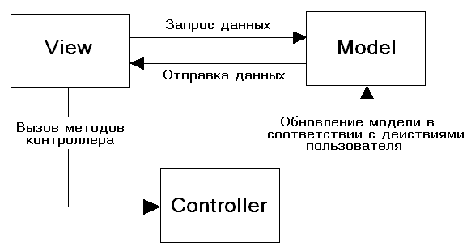

# Лекція 12. Структура типового проєкту з архітектурою MVC

[Перелік лекцій](../README.md)

## Вступ

Архітектурний підхід MVC (Model–View–Controller) є одним із найпоширеніших способів організації коду в програмних системах. Його популярність пояснюється тим, що він пропонує чітке й логічне розділення відповідальностей, завдяки якому розробка стає більш передбачуваною, а підтримка — простішою. Основна ідея MVC полягає в тому, щоб відокремити дані та логіку роботи з ними від способу їх відображення та від дій користувача. Це дозволяє кожній частині системи розвиватися незалежно й з меншими ризиками.

Робота системи за принципом MVC є послідовною. Користувач ініціює певну дію. Контролер приймає цю дію й вирішує, які дані необхідно отримати чи змінити, звертаючись до моделі. Модель виконує потрібну операцію та повертає результат. Контролер отримує цей результат і передає його у відповідне представлення. Представлення формує користувацький інтерфейс і відображає його. Такий цикл дає змогу чітко розмежувати обов’язки: жоден компонент не перевантажений функціоналом, а код залишається організованим.

MVC сприяє покращенню керованості та масштабованості проєкту. Завдяки чіткому розділенню компонентів команда розробників може працювати паралельно, не заважаючи одне одному: хтось удосконалює інтерфейс, інший — оптимізує модель, ще один — переписує логіку контролера. До того ж архітектура полегшує тестування, оскільки моделі, контролери та навіть представлення можна перевіряти окремо. У великих або тривалих проєктах така організованість має вирішальне значення.

Шаблон MVC описує простий спосіб побудови структури застосунку з метою відокремлення бізнес-логіки від користувацького інтерфейсу. Як результат, застосунок легше масштабувати, тестувати, підтримувати та розширювати.

## Архітектура MVC
У моделі MVC модель надає дані й правила бізнес-логіки, представлення відповідає за користувацький інтерфейс, а контролер забезпечує взаємодію між моделлю та представленням.

У типовій проєктній структурі папки й файли організовуються таким чином, щоб кожен тип компонентів був чітко відокремлений. Моделі зазвичай розташовані в окремому каталозі, де зберігаються класи або модулі, що описують дані та їхні методи. У папці представлень містяться шаблони або файли інтерфейсу, які використовує система для показу інформації. Контролери зберігаються окремо, що дозволяє легко знайти відповідальну за певну частину застосунку логіку. Окрім них, у проєкті можуть існувати додаткові каталоги для конфігурацій, статичних файлів, допоміжних сервісів або утиліт, але загальна структура завжди будується навколо трьох основних компонентів.

Типова послідовність роботи MVC-застосунку:
1. Коли користувач заходить на веб-ресурс, ініціалізаційний скрипт створює екземпляр застосунку і запускає його.
2. Відображається вигляд головної сторінки сайту.
3. Застосунок отримує запит від користувача й визначає запитувані контролер і дію. Для головної сторінки виконується дія за замовчуванням (index).
4. Застосунок створює екземпляр контролера й запускає метод дії, де, наприклад, викликаються моделі, які зчитують інформацію з бази даних.
5. Дія формує представлення з даними, отриманими з моделі, і показує результат користувачу.

### Модель
У центрі архітектури розташована модель (Model) — компонент, який відповідає за дані та правила їх обробки. Модель знає про структуру інформації, якою оперує застосунок, і про способи збереження цієї інформації. Вона може взаємодіяти з базою даних, зовнішніми сервісами або внутрішньою бізнес-логікою, але при цьому не повинна знати, як саме ці дані будуть показані користувачеві чи які інтерфейсні елементи з ними працюють. Можна сказати, що модель — це серце застосунку, оскільки вона зберігає його стан і правила його зміни.

Модель містить бізнес-логіку застосунку, включає методи вибірки (наприклад, ORM), обробки даних (наприклад, правила валідації) і надання конкретних даних.

### Вид
Іншим важливим елементом є представлення (View), тобто частина, яка відповідає за те, як дані потрапляють до користувача. View може бути звичайною веб-сторінкою, набором UI-компонентів у застосунку, шаблоном або будь-яким іншим способом подання інформації. Представлення не виконує бізнес-логіку й не знає, як ці дані були отримані — його завданням є лише відображення. Тому View є гнучким: у більшості архітектурних підходів його можна змінювати, не торкаючись внутрішньої логіки застосунку. Саме завдяки цьому MVC дозволяє легко адаптувати інтерфейс під різні платформи або вимоги, не змінюючи базових алгоритмів.

Вид використовується для задання зовнішнього відображення даних, отриманих із контролера й моделі.

### Контролер
Зв’язком між моделлю та представленням виступає контролер (Controller). Він приймає вхідні дії користувача — наприклад, натискання кнопок, переходи за посиланнями або надсилання форми. Контролер визначає, що саме потрібно зробити: звернутися до моделі за даними, оновити їх або виконати певний алгоритм. Після цього він обирає відповідне представлення, якому передає результати роботи. Контролер не зберігає стан застосунку й не відображає дані безпосередньо — він лише організовує процес. Саме тому його часто називають "керівним центром" або "посередником" між користувачем і логікою програми.

Контролер є зв’язуючою ланкою між моделями, видами й іншими компонентами. Він відповідає за обробку запитів користувача.

#### Front Controller та Page Controller
Є два основних підходи до організації контролерів: **Page Controller** і **Front Controller**.

**Page Controller** використовує кілька різних сценаріїв для кожної сторінки, тоді як **Front Controller** об'єднує всі запити через один файл.

### Маршрутизація URL
У більшості застосунків, побудованих за архітектурою MVC, важливу роль відіграє маршрутизація. Це механізм, який визначає, який саме контролер має обробити той чи інший запит. Коли користувач переходить на певну адресу або виконує дію, система маршрутизації аналізує шлях, параметри та тип запиту й перенаправляє його до відповідного методу контролера. Таким чином, маршрути виступають своєрідною картою застосунку: вони пов’язують зовнішні запити з внутрішньою логікою. Правильне налаштування маршрутизації робить структуру проєкту прозорою, полегшує навігацію в коді та дає змогу легко розширювати функціональність, додаючи нові кінцеві точки, не порушуючи роботу вже існуючих. У великих системах маршрутизація також дозволяє розподіляти відповідальність між різними контролерами, зберігаючи чисту, зрозумілу структуру застосунку.

Маршрутизація дозволяє налаштувати застосунок на прийом запитів із URL, які не відповідають реальним файлам, а також використовувати ЧПУ (читабельні посилання) для кращої оптимізації та зручності користувачів.

Тепер, маючи достатні теоретичні знання, ми можемо перейти до практичної частини.

## Переваги використання MVC

Розділення логіки: HTML і PHP не змішуються безпосередньо.

Зручність тестування: Можна тестувати моделі незалежно від інтерфейсу.

Гнучкість: Легко змінювати представлення без зміни логіки.

Масштабованість: Код структурується і легко розширюється новими модулями.

## Недоліки MVC

Початкова складність: Для малих проєктів MVC може здаватися «надлишковим».

Потреба в налаштуваннях: Необхідно створити базову структуру, маршрутизатор тощо.

Подвійне завантаження даних: При складних моделях може знадобитися кешування.

## MVC у сучасних фреймворках

Більшість сучасних фреймворків (Laravel, Symfony, CodeIgniter, Django, Ruby on Rails) реалізують ідею MVC із власними варіаціями:

Laravel використовує Route → Controller → View, з підтримкою шаблонізатора Blade.

Symfony вводить Service Container і Event Dispatcher, але загальна логіка залишається подібною.

Django у Python використовує схему MTV (Model–Template–View), що фактично є адаптацією MVC.

## Коротке узагальнене порівняння MVC, MVP і MVVM

Щоб краще зрозуміти, у яких випадках застосовується MVC, корисно знати, чим він відрізняється від інших архітектур.

MVC передбачає, що представлення пасивне: воно просто отримує дані від контролера. Контролер керує всім процесом — від отримання дій користувача до оновлення представлення. Цей підхід добре працює там, де логіка взаємодії проста і де важливо зберігати чітку структуру.

MVP (Model–View–Presenter) розвиває ідею MVC й робить View більш активним. Тут представлення само викликає Presenter (аналог контролера), а Presenter повертає уже підготовлені дані. Представлення не містить логіки, але відповідає за ініціювання взаємодії. MVP часто використовують у застосунках з багатими інтерфейсами, де потрібно мінімізувати “залежність” між View та іншими компонентами.

MVVM (Model–View–ViewModel) побудований навколо концепції двостороннього зв’язування даних. Представлення напряму “підписується” на зміну даних у ViewModel, і як тільки стан змінюється, UI оновлюється автоматично. Це робить MVVM надзвичайно ефективним для платформ, де є механізми data-binding, наприклад у мобільних застосунках або сучасних фронтенд-фреймворках.

## Підсумок

Архітектура MVC — це не просто «мода» чи шаблон, а фундаментальний підхід до розділення відповідальностей у програмному забезпеченні. Зрозумівши принципи її роботи на базовому рівні, ви зможете швидше орієнтуватися в будь-якому сучасному фреймворку.

Водночас важливо пам’ятати, що MVC не є універсальним рішенням для будь-якої задачі. Маленькі проєкти можуть отримати надмірну складність від розбиття на окремі компоненти, а деякі типи застосунків природніше описуються іншими архітектурними підходами. Проте у більшості випадків MVC надає стабільну, зрозумілу й перевірену часом структуру, яка допомагає утримувати проєкт у порядку.

## Теми для самостійного вивчення

1. Розширення MVC до архітектури HMVC.
2. Використання шаблонізаторів (Blade, Twig, Smarty).
3. Застосування ORM (Eloquent, Doctrine).
4. Принципи Dependency Injection та Service Container.
5. Реалізація REST API на базі MVC.

## Контрольні запитання

1. Які основні компоненти входять до архітектури MVC?
2. У чому відмінність між Front Controller і Page Controller?
3. Яку роль виконує маршрутизатор у MVC-застосунку?
4. Як реалізується взаємодія між контролером і моделлю?
5. Які переваги та недоліки має використання MVC?
6. Як MVC-архітектура реалізована у фреймворку Laravel?

## Література та посилання

1. Е. Гамма, Р. Хелм, Р. Джонсон, Дж. Вліссідес Прийоми об'єктно-орієнтованого проєктування. Шаблони проєктування
2. М. Фаулер Архітектура корпоративних програмних додатків