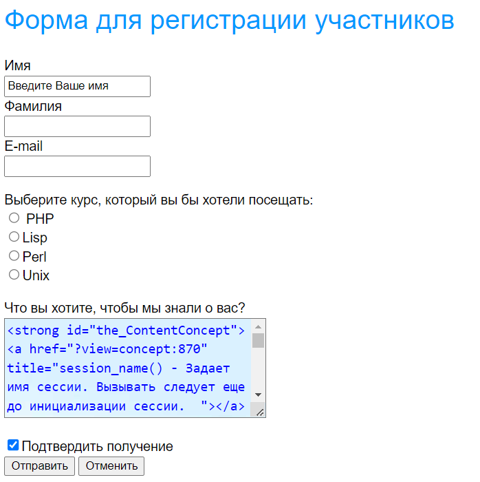

# Використання суперглобальних масивів. Передача даних методами POST та GET


### Протокол HTTP і способи передачі даних на сервер

HTTP (HyperText Transfer Protocol, протокол передачі гіпертексту) - це протокол прикладного рівня, розроблений для обміну гіпертекстової інформацією в Internet.

**HTTP** надає набір методів для вказівки цілей запиту, що відправляється серверу. Ці методи основані на узгодженості посилань, де для вказівки ресурсу, до якого має бути застосований даний метод, використовується універсальний ідентифікатор ресурсів (Universal Resource Identifier) у вигляді місцезнаходження ресурсу (Universal Resource Locator, URL) або у вигляді його універсального імені (Universal Resource Name , URN).

Повідомлення по мережі при використанні протоколу HTTP передаються у форматі, схожому з форматом поштового повідомлення Internet (RFC-822) або з форматом повідомлень MIME (Multipurpose Internet Mail Exchange).

HTTP використовується для комунікацій між різними користувацькими програмами та програмами-шлюзами, що надають доступ до існуючих Internet-протоколів, таких як SMTP (протокол електронної пошти), NNTP (протокол передачі новин), FTP (протокол передачі файлів), Gopher і WAIS. HTTP розроблений для того, щоб дозволяти таким шлюзам через проміжні програми-сервери (proxy) передавати дані без втрат.

Протокол реалізує принцип запит / відповідь. Запитуюча програма-клієнт ініціює взаємодію з відповідною програмою-сервером, і надсилає запит, який містить:

*   метод доступу;
*   адресу URI;
*   версію протоколу;
*   повідомлення (схоже за формою на MIME) з інформацією про тип переданих даних, інформацією про клієнта, що послав запит, і, можливо, із змістовною частиною (тілом) повідомлення.

**Відповідь сервера містить:**

*   рядок стану, в яку входить версія протоколу і код повернення (успіх або помилка);
*   повідомлення (у формі, схожій на MIME), до якого входить інформація сервера, метаінформація (тобто інформація про зміст повідомлення) і тіло повідомлення.

У протоколі не вказується, хто повинен відкривати і закривати з'єднання між клієнтом і сервером. На практиці з'єднання, як правило, відкриває клієнт, а сервер після відправки відповіді ініціює його розриває.

### Форма запиту клієнта

Клієнт відсилає серверу запит в одній з двох форм: у повній або скороченій. Запит у першій формі називається відповідно повним запитом, а в другій формі - простим запитом.

Простий запит містить метод доступу та адресу ресурсу. Формально це можна записати так:

<Простий-Запит>: = <Метод> <символ пробіл> <Запитуваний-URI> <символ нового рядка>

В якості методу можуть бути вказані GET, POST, HEAD, PUT, DELETE та інші. Про найбільш поширені з них ми поговоримо трохи пізніше. В якості запитуваної URI найчастіше використовується URL-адреса ресурсу.

**Приклад простого запиту:** GET [http://phpbook.info/](http://phpbook.info/)

Тут **GET** - це метод доступу, тобто метод, який повинен бути застосований до запитуваного ресурсу, а [http://phpbook.info/](http://phpbook.info/) - це URL-адреса запитуваного ресурсу.

Повний запит містить рядок стану, кілька заголовків (заголовок запиту, загальний заголовок або заголовок запису) і, можливо, тіло запиту. Формально загальний вигляд повного запиту можна записати так:

<Повний запит>: = <Рядок Стану> (<Загальний заголовок> | <Тема запиту> | <Заголовок змісту>) <Символ нового рядка> [<Зміст запиту>]

Квадратні дужки тут позначають необов'язкові елементи заголовка, через вертикальну риску перераховані альтернативні варіанти. Елемент <Рядок стану> містить метод запиту та URI ресурсу (як і простий запит) і, крім того, використовувану версію протоколу HTTP. Наприклад, для виклику зовнішньої програми можна задіяти наступний рядок стану:

POST [http://phpbook.info/cgi-bin/test](http://phpbook.info/cgi-bin/test) HTTP/1.0

У даному випадку використовується метод POST і протокол HTTP версії 1.0.

В обох формах запиту важливе місце займає URI запитуваного ресурсу. Найчастіше URI використовується у вигляді URL-адреси ресурсу. При зверненні до сервера можна застосовувати як повну форму URL, так і спрощену.

Повна форма містить тип протоколу доступу, адресу сервера ресурсу та адресу ресурсу на сервері (рис 1).

У скороченій формі опускають протокол і адресу сервера, вказуючи лише місце розташування ресурсу від кореня сервера. Повну форму використовують, якщо можливе пересилання запиту іншого сервера. Якщо ж робота відбувається тільки з одним сервером, то частіше застосовують скорочену форму.

 Рис. 1. Повна форма URL

### Методи

Метод повідомляє про мету запиту клієнта. Протокол HTTP підтримує досить багато методів, але реально використовуються тільки три: POST, GET і HEAD. Метод GET дозволяє отримати будь-які дані, ідентифіковані за допомогою URI в запиті ресурсу. Якщо URI вказує на програму, то повертається результат роботи програми, а не її текст (якщо, звичайно, текст не є результат її роботи). Додаткова інформація, необхідна для обробки запиту, вбудовується в сам запит (у рядок статусу). При використанні методу GET у поле тіла ресурсу повертається власне затребувана інформація (текст HTML-документа, наприклад).

Існує різновид методу GET - **умовний GET.** Цей метод повідомляє серверу про те, що на запит потрібно відповісти, тільки якщо виконуються умови, що міститься в полі if-Modified-Since заголовка запиту. Якщо говорити більш точно, то тіло ресурсу передається у відповідь на запит, якщо цей ресурс змінювався після дати, зазначеної в if-Modified-Since.

Метод **HEAD** аналогічний методу GET, тільки не повертає тіло ресурсу і не має умовного аналога. Метод HEAD використовують для отримання інформації про ресурс. Це може стати в нагоді, наприклад, при вирішенні завдання тестування гіпертекстових посилань.

Метод **POST** розроблений для передачі на сервер такої інформації, як анотації ресурсів, новини і поштові повідомлення, дані для додавання в базу даних, тобто для передачі інформації великого обсягу і досить важливої. На відміну від методів GET і HEAD, в POST передається тіло ресурсу, яке і є інформацією, одержану з полів форм або інших джерел введення.

До цих пір ми тільки теоретизували, знайомилися з основними поняттями. Тепер варто навчитися використовувати все це на практиці. Далі в лекції ми розглянемо, як посилати запити серверу і як обробляти його відповіді.

### Використання HTML-форм для передачі даних на сервер

Як передавати дані серверу? Для цього в мові HTML є спеціальна конструкція - **форми.** Форми призначені для того, щоб отримувати від користувача інформацію. Наприклад, вам потрібно знати логін і пароль користувача для того, щоб визначити, на які сторінки сайту його можна допускати. Або вам необхідні особисті дані користувача, щоб була можливість з ним зв'язатися. Форми якраз і застосовуються для введення такої інформації. У них можна вводити текст або вибирати підходящі варіанти зі списку. Дані, записані у форму, відправляються для обробки спеціальною програмою (наприклад, скриптом на PHP) на сервері. Залежно від введених користувачем даних ця програма може формувати різні web-сторінки, відправляти запити до бази даних, запускати різні додатки і т.п.

Розберемося з синтаксисом HTML-форм. Можливо, багато хто з ним знайомий, але ми все ж повторимо основні моменти, оскільки це важливо.

Отже, для створення форми мовою HTML використовується тег FORM. Всередині нього знаходиться одна або декілька команд INPUT. За допомогою атрибутів action і method тега FORM задаються ім'я програми, яка буде обробляти дані форми, і метод запиту, відповідно. Команда INPUT визначає тип і різні характеристики запитуваної інформації. Надсилання даних форми відбувається після натискання кнопки input типу submit. Створимо форму для реєстрації учасників заочної школи програмування.

```html
<h2>Форма для регистрации участников</h2>
<form action="1.php" method=POST>
  <!--создаем форму-->
  <!--данные формы будет обрабатывать файл 1.php, при 
    отправке запроса будет использован метод POST--> Имя <br>
  <input type=text name="first_name" value="Введите Ваше имя">
  <br> Фамилия <br>
  <input type=text name="last_name">
  <br> E-mail <br>
  <input type=text name="email">
  <br>
  <p> Выберите курс, который вы бы хотели посещать: <br>
    <input type=radio name="kurs" value="PHP">PHP <br>
    <input type=radio name="kurs" value="Lisp">Lisp <br>
    <input type=radio name="kurs" value="Perl">Perl <br>
    <input type=radio name="kurs" value="Unix">Unix <br>
  <P>Что вы хотите, чтобы мы знали о вас? <BR>
    <textarea name="comment" cols=32 rows=5></textarea>
  <P>
    <input name="confirm" type=checkbox checked>Подтвердить получение <br>
    <input type=submit value="Отправить">
    <input type=reset value="Отменить">
</form>
```



### Для методу GET

Для методу GET При відправці даних форми за допомогою методу GET вміст форми додається до URL після знака запитання у вигляді пар імен = значення, об'єднаних за допомогою амперсанда &:

'action?name1=value1=name2=value2&name3=value3'

Тут action - це URL-адреса програми, яка повинна обробляти форму (це або програма, задана в атрибуті action тега form, або сама поточна програма, якщо цей атрибут опущений). Імена name1, name2, name3 відповідають іменам елементів форми, а value1, value2, value3 - значення цих елементів. Всі спеціальні символи, включаючи = і &, в іменах або значеннях цих параметрів будуть закодовані. Тому не варто використовувати в назвах або значеннях елементів форми ці символи і символи кирилиці в ідентифікаторах.

Якщо в полі для введення ввести який-небудь службовий символ, то він буде переданий в його шістнадцятковому коді, наприклад, символ $ заміниться на% 24. Так само передаються і кирилиця.

Для полів введення тексту і пароля (це елементи input з атрибутом type = text і type = password), значенням буде те, що введе користувач. Якщо користувач нічого не вводить в таке поле, то в рядку запиту буде присутній елемент name =, де name відповідає імені цього елемента форми.

Для кнопок типу **checkbox** і **radio button** значення **value** визначається атрибутом VALUE в тому випадку, коли кнопка відзначена. Не зазначені кнопки при складанні рядка запиту ігноруються повністю. Кілька кнопок типу checkbox можуть мати один атрибут NAME (і різні VALUE), якщо це необхідно. Кнопки типу radio button призначені для одного з усіх запропонованих варіантів і тому повинні мати однаковий атрибут NAME і різні атрибути VALUE.

У принципі створювати HTML-форму для передачі даних методом GET не обов'язково. Можна просто додати рядок URL потрібні змінні та їх значення.

[http://phpbook.info/test.php?id=10&user=pit](http://phpbook.info/test.php?id=10&user=pit)

У зв'язку з цим у передачі даних методом GET є один істотний недолік - будь-хто може підробити значення параметрів. Тому не радимо використовувати цей метод для доступу до захищених паролем сторінок, для передачі інформації, що впливає на безпеку роботи програми або сервера. Крім того, не варто застосовувати метод GET для передачі інформації, яку не дозволено змінювати користувачеві.

Незважаючи на всі ці недоліки, використовувати метод GET досить зручно при налагодженні скриптів (можна бачити значення й імена переданих змінних) і для передачі параметрів, які не впливають на безпеку.

### Для методу POST

Вміст форми кодується точно так само, як для методу **GET**, але замість додавання рядка до **URL** вміст запиту надсилається блоком даних як частина операції POST. Якщо присутній атрибут **ACTION**, то значення **URL**, яке там знаходиться, визначає, куди посилати цей блок даних. Цей метод, як уже зазначалося, рекомендується для передачі великих за обсягом блоків даних.

Інформація, введена користувачем і відправлена серверу за допомогою методу POST, подається на стандартне введення програми, зазначеної в атрибуті action, чи поточного скрипту, якщо цей атрибут опущений. Довжина посилається файлу передається у змінній оточення CONTENT\_LENGTH, а тип даних - у змінній CONTENT\_TYPE.

Передати дані методом POST можна тільки за допомогою HTML-форми, оскільки дані передаються в тілі запиту, а не в заголовку, як у GET. Відповідно і змінити значення параметрів можна, тільки змінивши значення, введене в форму. При використанні POST користувач не бачить чи передаються серверу дані.

_Основна перевага POST запитів_ \- це їхня велика безпека і функціональність у порівнянні з GET-запитами. Тому метод POST частіше використовують для передачі важливої інформації, а також інформації великого обсягу. Тим не менш не варто цілком покладатися на безпеку цього механізму, оскільки дані POST запиту також можна підробити, наприклад створивши html-файл на своїй машині і заповнивши його потрібними даними. Крім того, не всі клієнти можуть застосовувати метод POST, що обмежує варіанти його використання.

При відправці даних на сервер будь-яким методом передаються не тільки самі дані, введені користувачем, але і ряд змінних, які називаються змінними середовища, що характеризують клієнта, історію його роботи, шляхи до файлів і т.п. Ось деякі із змінних оточення:

*   REMOTE\_ADDR - IP-адреса хоста (комп'ютера), що відправляє запит;
*   REMOTE\_HOST - ім'я хоста, з якого надіслано запит;
*   HTTP\_REFERER - адреса сторінки, що посилається на поточний скрипт;
*   REQUEST\_METHOD - метод, який був використаний при відправці запиту;
*   QUERY\_STRING - інформація, яка перебуває в URL після знака питання;
*   SCRIPT\_NAME - віртуальний шлях до програми, яка повинна виконуватися;
*   HTTP\_USER\_AGENT - інформація про браузер, який використовує клієнт

### Обробка запитів за допомогою PHP

До цих пір ми згадували тільки, що запити клієнта обробляються на сервері за допомогою спеціальної програми. Насправді цю програму ми можемо написати самі, в тому числі і на мові PHP, і вона буде робити з отриманими даними все, що ми захочемо. Для того, щоб написати цю програму, необхідно познайомитися з деякими правилами і інструментами, запропонованими для цих цілей PHP.

Усередині PHP-скрипта є декілька способів отримання доступу до даних, переданим клієнтом по протоколу HTTP. До версії PHP 4.1.0 доступ до таких даних здійснювався за іменами переданих змінних (нагадаємо, що дані передаються у вигляді пар «ім'я змінної, символ« = », значення змінної»). Таким чином, якщо, наприклад, було передано first\_name = Nina, то всередині скрипта з'являлася змінна $first\_name зі значенням Nina. Якщо потрібно розрізняти, яким методом були передані дані, то використовувалися асоціативні масиви $HTTP\_POST\_VARS і $HTTP\_GET\_VARS, ключами яких були імена переданих змінних, а значеннями - відповідно значення цих змінних. Таким чином, якщо пара first\_name = Nina передана методом GET, то $ HTTP\_GET\_VARS ["first\_name"] = "Nina".

Використовувати в програмі імена переданих змінних безпосередньо небезпечно. Тому було вирішено починаючи з PHP 4.1.0 задіяти для звернення до змінних, переданих за допомогою HTTP-запитів, спеціальний масив - $ \_REQUEST. Цей масив містить дані, передані методами POST і GET, а також за допомогою HTTP cookies. Це Суперглобальний асоціативний масив, тобто його значення можна отримати в будь-якому місці програми, використовуючи як ключ ім'я відповідної змінної (елементу форми).

Приклад 2. Припустимо, ми створили форму для реєстрації учасників заочної школи програмування, як у наведеному вище прикладі. Тоді у файлі 1.php, що обробляє цю форму, можна написати наступне:

```php
<?php
$str =
    "Здрастуйте, " .
    $_REQUEST[" First_name "] .
    " " .
    $_REQUEST[" Last_name "] .
    "! <br> ";
$str .= "Ви обрали для вивчення курс по " . $_REQUEST[" Kurs "];
echo $str;
?>
```

Тоді, якщо в формі ми ввели ім'я «Вася», прізвище «Петров» і вибрали серед усіх курсів курс по PHP, на екрані браузера отримаємо таке повідомлення:

Здравствуйте, Вася Петров! Ви обрали для вивчення курс по PHP

Після введення масиву `$_REQUEST` масиви `$HTTP\_POST\_VARS` і `$HTTP\_GET\_VARS` для однорідності були перейменовані в `$_POST` і `$_GET` відповідно, але самі вони з вжитку не зникли з міркувань сумісності з попередніми версіями PHP. На відміну від своїх попередників, масиви `$_POST` і `$_GET` стали суперглобальними, тобто доступними безпосередньо і всередині функцій і методів.

Наведемо приклад використання цих масивів. Припустимо, нам потрібно обробити форму, що містить елементи введення з іменами first\_name, last\_name, kurs (наприклад, форму form.html, наведену вище). Дані були передані методом POST, і дані, передані іншими методами, ми обробляти не хочемо. Це можна зробити наступним чином:

<? Php $Str = "Здрастуйте, ". $_POST [" First\_name "]." ". $_POST [" Last\_name "]."! <br> "; $Str .= "Ви обрали для вивчення курс по". $_POST ["Kurs"]; echo $Str; ?>

Тоді на екрані браузера, якщо ми ввели ім'я «Вася», прізвище «Петров» і вибрали серед усіх курсів курс по PHP, побачимо повідомлення, як у попередньому прикладі:

Здравствуйте, Вася Петров! Ви обрали для вивчення курс по PHP

Для того, щоб зберегти можливість обробки скриптів більш ранніх версій, ніж PHP 4.1.0, була введена директива register\_globals, що дозволяє чи забороняє доступ до змінних безпосередньо за їхніми іменами. Якщо у файлі налаштувань PHP параметр register\_globals = On, то до змінних, переданим сервера методами GET і POST, можна звертатися просто за їхніми іменами (тобто можна писати $first\_name). Якщо ж register\_globals = Off, то потрібно писати $_REQUEST ["first\_name"] або $_POST ["first\_name"], $_GET ["first\_name"], $HTTP\_POST\_VARS ["first\_name"], $HTTP\_GET\_VARS ["first\_name"]. З точки зору безпеки цю директиву краще відключати (тобто register\_globals = Off). При включеній директиві register\_globals перераховані вище масиви також будуть містити дані, передані клієнтом.

Іноді виникає необхідність дізнатися значення якої-небудь змінної оточення, наприклад метод, що використовувався при передачі запиту або IP-адреса комп'ютера, що відправив запит. Отримати таку інформацію можна за допомогою функції getenv(). Вона повертає значення змінної оточення, ім'я якої передано їй як параметр.

<? getenv ('REQUEST\_METHOD'); // Поверне використаний метод echo getenv ('REMOTE\_ADDR'); // Виведе IP-адресу користувача, // Послав запит ?>

Все, що записано в URL після знака запитання, можна отримати за допомогою команди

**getenv ('QUERY\_STRING')**;

Завдяки цьому можна методом GET передавати дані в якому-небудь іншому вигляді. Наприклад, вказувати тільки значення декількох параметрів через знак плюс, а в скрипті розбивати рядок запиту на частини або можна передавати значення лише одного параметра. У цьому випадку в масиві $_GET з'явиться порожній елемент з ключем, рівним цьому значенню (всього рядка запиту), причому символ «+», що зустрівся в рядку запиту, буде замінений на підкреслення «\_».

Методом POST дані передаються тільки за допомогою форм, і користувач (клієнт) не бачить, які саме дані відправляються серверу. Щоб їх побачити, хакер повинен підмінити нашу форму на власну. Тоді сервер відправить результати обробки неправильної форми не туди, куди потрібно. Щоб цього уникнути, можна перевіряти адресу сторінки, з якої були надіслані дані. Це можна зробити знову ж за допомогою функції getenv ():

**getenv ('HTTP\_REFERER')**;

### Приклад обробки запиту за допомогою PHP

Нагадаємо, в чому полягало завдання, і уточнимо його формулювання. Потрібно написати форму для реєстрації учасників заочної школи програмування і після реєстрації відправити учаснику повідомлення. Ми назвали це повідомлення універсальним листом, але воно буде трохи відрізнятися від того листа, який ми склали вище. Тут ми не будемо відправляти що-небудь по електронній пошті, щоб не уподібнюватися спамерам, а просто згенеруємо це повідомлення і виведемо його на екран браузера. Початковий варіант форми реєстрації ми вже наводили вище. Змінимо його таким чином, щоб кожен хто реєструється, міг вибрати скільки завгодно курсів для відвідування, і не будемо підтверджувати отримання реєстраційної форми.

<h2> Форма для реєстрації студентів </ h2> <form action="1.php" method=POST> Ім'я <br> <input type = text name = "first\_name" value = "Ваше ім'я"> <br> Прізвище <br> <input type=text name="last\_name"> <br> E-mail <br> <input type=text name="email"> <br> lt;p> Виберіть курс, який ви б хотіли відвідувати: lt;br> lt;input type=checkbox name='kurs[]' value='PHP'> PHP <br> lt;input type=checkbox name='kurs[]' value='Lisp'> Lisp <br> lt;input type=checkbox name='kurs[]' value='Perl'> Perl <br> lt;input type=checkbox name='kurs[]' value='Unix'> Unix <br> lt;P> Що ви хочете, щоб ми знали про вас? <BR> lt;textarea name="comment" cols=32 rows=5> </ textarea> lt;input type=submit value="Відправте"> lt;input type=reset value="Відмінити"> </ Form>

Тут все досить просто і зрозуміло. Єдине, що можна відзначити, - це спосіб передачі значень елемента checkbox. Коли ми пишемо в імені елемента kurs [], це означає, що перший зазначений елемент checkbox буде записаний в перший елемент масиву kurs, другий зазначений checkbox - у другий елемент масиву і т.д. Можна, звичайно, просто дати різні імена елементів checkbox, але це ускладнить обробку даних, якщо курсів буде багато.

Скрипт, який все це буде розбирати і обробляти, називається 1.php (форма посилається саме на цей файл, що записано в її атрибуті action). За замовчуванням використовується для передачі метод GET, але ми вказали POST. За отриманими даними від зареєстрованої людини, скрипт генерує відповідне повідомлення. Якщо людина вибрала якісь курси, то йому виводиться повідомлення про час їх проведення та про лекторів, які їх читають. Якщо людина нічого не вибрав, то виводиться повідомлення про наступні збори заочної школи програмістів (ЗШП).

<? // Створимо масиви відповідностей курс - час його // Проведення та викладач курсу $times = array ("PHP" => "14.30", "Lisp" => "12.00", "Perl" => "15.00", "Unix" => "14.00"); $lectors = array ("PHP" => "Василь Васильович", "Lisp" => "Іван Іванович", "Perl" => "Петро Петрович", "Unix" => "Семен Семенович"); define ("SIGN", "З повагою, адміністрація"); // Визначаємо підпис листа як константу define ("MEETING\_TIME", "18.00"); // Задаємо час зборів студентів $date = "12 травня"; // задаємо дату проведення лекцій // Починаємо складати текст повідомлення $str = "Здрастуйте, шановний". $_POST ["First\_name"]. "". $_POST ["Last\_name "]."!<br>"; $str .= "<br> Повідомляємо Вам, що"; $kurses = $_POST ["kurs"]; // збережемо в цій змінній // Список вибраних курсів if (!isset ($kurses)) {// якщо не обраний жоден курс $event = "наступні збори студентів"; $str .= "$event відбудеться $date". MEETING\_TIME. "<br>"; } Else {// якщо хоча б один курс вибраний $event = "обрані Вами лекції відбудуться $date <ul>"; // Функція count обчислює число елементів у масиві $lect = ""; for ($i = 0; $i <count ( kurses); $i++) { // Для кожного обраного курсу $k = $kurses [$i]; // запам'ятовуємо назву курсу $lect = $lect. "<li> Лекція з $k в $times [$k]"; // Складаємо повідомлення $lect .= "(Ваш лектор, $lectors [$k])"; } $event = $event. $lect. "</ Ul>"; $str .= "$event"; } $str .= "<br>". SIGN; // додаємо підпис echo $str; // виводимо повідомлення на екран ?>

### Суперглобальні масиви

Розглянемо роботу суперглобальних змінних в PHP.

У PHP існує кілька суперглобальний змінних, а точніше суперглобальних масивів:

*   $_SERVER
*   $_GET
*   $_POST
*   $_FILES
*   $_COOKIE
*   $_SESSION
*   $_REQUEST
*   $_ENV

### Суперглобальний масив $_SERVER

Масив являє собою інформацію про заголовки, шляхи та розміщення скриптів. Записи в цьому масиві створюються веб-сервером. Не існує гарантій, що веб-сервер сформує цей масив з усіма параметрами. Даний масив містить такі елементи:

**PHP\_SELF:** ім'я файлу, що в даний час виконується PHP-скриптом. Наприклад при виконанні скрипта [http://phpprogs.ru/test/guestbook2/](http://phpprogs.ru/test/guestbook2/) даний елемент буде приймати значення / test/guestbook2/index.php.

**argv:** список аргументів, переданих скрипту. Якщо використовує в командному рядку, то отримуєте масив значень, якщо використовується $_GET, то буде містити рядок запиту.

**argc:** містить число параметрів переданих сценарієм (якщо запуск був з командного рядка).

**GATEWAY\_INTERFACE:** параметр повертає версію CGI, яку використовує веб-сервер.

**SERVER\_ADDR:** елемент містить IP адресу сервера, де виконується скрипт.

**SERVER\_NAME:** елемент містить ім'я веб-сервера, де виконується скрипт.

**SERVER\_SOFTWARE:** ідентифікаційний рядок веб-сервера, який повертається у відповідь при запитах.

**SERVER\_PROTOCOL:** ім'я та версія протоколу HTTP.

**REQUEST\_METHOD:** використовуваний метод запиту до веб-сервера (POST, GET, HEAD, PUT).

**REQUEST\_TIME:** відмітка про час початку запиту (починаючи з PHP 5.1.0).

**QUERY\_STRING:** рядок запиту до веб-сторінки, якщо вона існує, за допомогою якого був здійснений доступ до сторінки

**DOCUMENT\_ROOT:** коренева директорія, з якої виконується скрипт.

**HTTP\_ACCEPT:** зміст заголовка ACCEPT, якщо він є.

**HTTP\_ACCEPT\_CHARSET:** зміст заголовка ACCEPT-CHARSET, якщо він є. Наприклад 'iso-8859-1, \*, utf-8'.

**HTTP\_ACCEPT\_ENCODING:** зміст заголовка ACCEPT-ENCODING, якщо він є. Наприклад 'gzip'.

**HTTP\_ACCEPT\_LANGUAGE:** зміст заголовка ACCEPT-LANGUAGE, якщо він є. Наприклад 'en'.

**HTTP\_ACCEPT\_CONNECTION:** зміст заголовка ACCEPT-CONNECTION, якщо він є. Наприклад 'Keep-Alive'.

**HTTP\_HOST:** зміст заголовка HOST, тобто він є.

**HTTP\_REFERER:** адреса сторінки, з якої на поточну сторінку перейшло програмне забезпечення користувача. Не всі ПЗ користувача передають цей параметр, а деякиі ПЗ навіть змінюють його. Отже, даному параметру довіряти не можна.

**HTTP\_USER\_AGENT:** цей параметр містить інформацію про клієнт користувача (ПО користувача), який звертається до сторінки. Наприклад 'Mozilla/4.5 [RU] (X11; U; Linux 2.2.9 i586). Також цю інформацію Ви можете отримати з функції get\_browser ().

**HTTPS:** параметр містить інформацію, якщо запит був зроблений через HTTPS.

**REMOTE\_ADDR:** IP-адреса користувача, з якого він переглядає сторінку.

**REMOTE\_HOST:** ім'я хоста користувача, з якого він переглядає цю сторінку.

**REMOTE\_POST:** порт, який використовується для з'єднання з веб-сервером.

**SCRIPT\_FILENAME:** абсолютний шлях до поточного скрипта.

**SERVER\_ADMIN**: значення SERVER\_ADMIN, взяте з конфігураційного файлу Apache.

**SERVER\_PORT:** порт веб-сервера, використаний для передачі даних по HTTP. За замовчуванням 80.

**SERVER\_SIGNATURE:** рядок, що містить версію веб-сервера і ім'я віртуального хоста.

**PATH\_TRANSLATED:** базовий шлях до поточного сценарія.

**SCRIPT\_NAME:** містить шлях та ім'я поточного скрипта.

**REQUEST\_URI:** URI для поточної сторінки.

**PHP\_AUTH\_DIGEST:** якщо PHP працює як модуль Apache, то параметр використовується як реквізити по протоколу HTTP для перевірки автентичності.

**PHP\_AUTH\_USER:** якщо PHP працює як модуль Apache або IIS, то параметр містить ім'я користувача при аутентифікації по протоколу HTTP.

**PHP\_AUTH\_PW:** якщо PHP працює як модуль Apache або IIS, то параметр містить пароль користувача при аутентифікації по протоколу HTTP.

**AUTH\_TYPE:** якщо PHP працює як модуль Apache або IIS, то параметр містить тип аутентифікації по протоколу HTTP.

### Суперглобальний масив $_GET

Масив $_GET представляє собою асоціативний масив елементів, переданих за допомогою HTTP GET запитів поточному PHP-скрипту. Немає необхідності оголошувати масив $_GET всередині функції користувача командою "global $_GET;", тому що даний масив є суперглобальний.

### Суперглобальний масив $_POST

Масив $_POST представляє собою асоціативний масив елементів, переданих за допомогою HTTP POST запитів поточному PHP-скрипту. Немає необхідності оголошувати масив $_POST всередині функції користувача командою "global $_POST;", тому що даний масив є суперглобальний.

### Суперглобальний масив $_FILES

Масив $_FILES представляє собою асоціативний масив елементів, переданих за допомогою HTTP POST запитів поточному PHP-скрипту. Немає необхідності оголошувати масив $_FILES всередині функції користувача командою "global $_FILES;", тому що даний масив є суперглобальний.

### Суперглобальний масив $_COOKIE

Масив $_COOKIE представляє собою асоціативний масив елементів, переданих за допомогою HTTP COOKIE запитів поточному PHP-скрипту. Немає необхідності оголошувати масив $_COOKIE всередині функції користувача командою "global $_COOKIE;", тому що даний масив є суперглобальний.

### Суперглобальний масив $_SESSION

Даний асоціативний масив містить змінні сесії, доступні для даного скрипта. Немає необхідності оголошувати масив $_SESSION всередині функції користувача командою "global $_SESSION;", тому що даний масив є суперглобальний.

### Суперглобальний масив $ \_REQUEST

Масив $_REQUEST є об'єднаним асоціативним масивом, який включає в себе масиви $_GET, $_POST, $_FILES. Немає необхідності оголошувати масив $_REQUEST всередині функції користувача командою "global $_REQUEST;", тому що даний масив є суперглобальний.

### Суперглобальний масив $ \_ENV

$_ENV Представляє собою асоціативний масив, який містить значення змінних з середовища, в якій працює інтерпретатор PHP. Немає необхідності оголошувати масив $_ENV всередині функції користувача командою "global $_ENV;", тому що даний масив є суперглобальний.